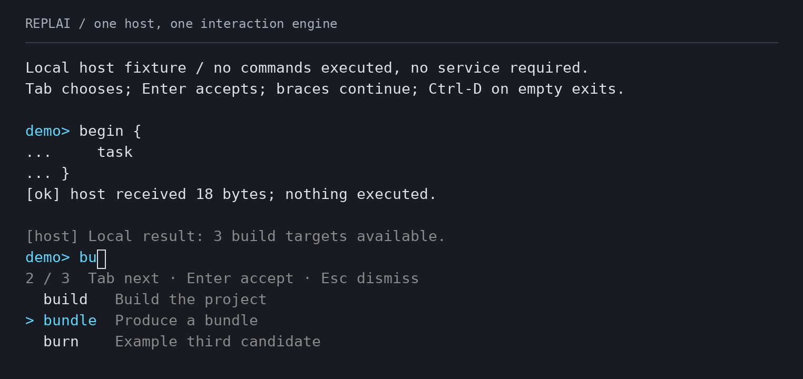

<p align="center">
  
  
</p>

<h1 align="center">REPLAI</h1>

<p align="center">
  <strong>The application owns the language.<br>REPLAI owns the line.</strong>
</p>
<p align="center">An embeddable terminal interaction engine for Rust and C.</p>
<p align="center">
  <a href="docs/interaction.md"></a>
  <a href="docs/c-api.md"></a>
  <a href="docs/architecture.md"></a>
  <a href="ROADMAP.md"></a>
  <a href="https://github.com/mothx9/replai/actions/workflows/ci.yml"></a>
  <a href="LICENSE"></a>
</p>

<p align="center">
  <a href="#quick-start">Quick Start</a> · <a href="#capabilities">Capabilities</a> ·
  <a href="#rust-integration">Rust</a> · <a href="#c--c-integration">C/C++</a> ·
  <a href="#verification">Verification</a> · <a href="#documentation">Docs</a>
</p>

## Overview

REPLAI provides Unicode editing, revision-safe host analysis, completion,
validated multiline interaction, structured presentation and terminal lifecycle
management. **Parsing, command semantics, execution, persistence and application
scheduling remain host-owned.** The richer analysis contracts are native Rust;
C ABI 1 provides the established session surface over the same engine.

A small line reader is easy to embed. A long-lived console also needs completion,
output arriving mid-draft and a terminal that is restored when interaction ends.
REPLAI brings those mechanics together without requiring a full-screen framework.
Start with a blocking read; take explicit control when the host needs more.

<p align="center">
  
</p>

Real PTY, host-owned semantics: validated multiline input, completion and output
with the active draft, cursor and selection preserved.

## Quick Start

On Linux or macOS, with Git and a current stable Rust toolchain:

```sh
git clone https://github.com/mothx9/replai.git
cd replai
cargo run --locked --example console
```

1. Type `begin {`, press Enter, then Tab and `task`. Enter continues the draft;
   type `}` and press Enter to submit the complete block.
2. Type `bu`, press Tab to see candidates, then Tab again to select `bundle`.
3. Leave the menu open for two seconds. A host timer delivers a local result;
   your draft and selection remain where you left them.
4. Enter accepts the candidate. A second Enter submits. Ctrl-D on an empty
   draft exits; Ctrl-C interrupts editing.

The [console host](examples/console.rs) uses fixed local data. It runs no build,
contacts no service and shares one host analysis across styles, completion and
brace validation. See [use-case recipes](docs/use-cases.md) for deterministic
CLIs, model chats, advanced embedding and terminal configurations.

## Capabilities

- **Editing:** bounded UTF-8 drafts, grapheme movement/deletion, multiline
  navigation, host-admitted history and atomic bracketed paste when admitted.
  The host owns history persistence and admission policy.
- **Analysis and completion:** immutable snapshots, draft revisions, stale-result
  refusal, ordered host candidates, selection/acceptance, editor style spans and
  non-canonical hints. Discovery, ranking and analysis scheduling stay external.
- **Validated multiline:** optional Complete / Incomplete / Invalid decisions,
  safe diagnostics, continuation prompts and indentation. The host owns grammar.
- **Presentation:** composed prompts, semantic roles and responsive documents;
  headings, facts, lists, tables and status use terminal-cell geometry.
- **Embedding and lifecycle:** blocking, explicit session and externally driven
  Rust tiers share one engine. Capability admission, serialized output and
  restoration belong to REPLAI; the application owns its loop and signal policy.
- **Interoperability:** an independently staged C ABI 1 adapter with static/shared
  artifacts and C/C++ consumer qualification. Its surface is deliberately smaller
  than the current Rust API.

## Architecture

```text
YOUR APPLICATION
language · parser · execution
state · persistence · scheduling
              │
       public contracts
              ▼
Rust: blocking / session / driven
C ABI 1: session adapter
              │
     one interaction engine
              │
 editor + revision provenance
 presentation / layout / render
              │
 protocol + resource driver
              ▼
    Linux / macOS terminal
```

These are responsibility boundaries, not threads. The deterministic engine does
not acquire descriptors or wait. The terminal driver advances that engine and
executes its effects. C calls the public Rust surface through an adapter; it does
not contain another editor.

### Components and public surfaces

```text
REPLAI
├── Editor
│   draft · graphemes · history
│   DraftRevision
├── Analysis contracts
│   snapshots · completion
│   validation · spans/hints
├── Interaction
│   blocking / session / driven
├── Presentation
│   prompts · documents
│   layout · render damage
├── Terminal contract
│   admission · decoding
│   readiness · resize · deadlines
└── Native realization
    Linux/macOS resources
    terminal restoration
```

`Editor` is usable without a terminal. `Interaction` combines its engine with an
active resource only while open. `AnalysisSnapshot` / `DraftRevision` identify
host input; `CompletionSet`, `ValidationResult` and `AnalysisPresentation` carry
separate revision-bound results. `Document`, `Block`, `Text`, `Prompt` and `Theme`
describe generic presentation. `TerminalFacts`, `TerminalConfig` and
`TerminalCapabilities` separate evidence, policy and the admitted contract.
Frames, decoder state and terminal mutations remain private.

The [architecture contract](docs/architecture.md) maps these responsibilities to
source owners. Rust API documentation is generated locally with `cargo doc --no-deps`.

## Installation

For a Rust host, add the qualified runtime checkpoint to your Cargo project:

```toml
[dependencies]
replai = { git = "https://github.com/mothx9/replai", rev = "da16302c33cdce5ef40978e02e9d8dff045c93f9" }
```

This pin identifies the qualified implementation including analysis presentation
and continuation indentation. Later README/logo commits are documentation
carriers, not different runtime releases. Exact revisions make pre-release
integration reproducible; updating a dependency remains a host decision.

Use a current stable Rust toolchain; no MSRV is declared. The core depends on
`unicode-segmentation` and `unicode-width`; Linux/macOS add `rustix`, and macOS
adds `nix` for native waiting. There is no daemon, background process or required
async runtime. See [C / C++ integration](#c--c-integration) for staged installation
and [development](docs/development.md) for contributor-only tooling.

## Rust integration

### Blocking

REPLAI keeps the small host small:

```rust
use replai::{Editor, Interaction, Prompt, ReadOutcome};

fn main() -> Result<(), Box<dyn std::error::Error>> {
    let mut input = Interaction::new(Editor::new(65_536, 100));
    loop {
        match input.read_line(Prompt::new("demo")?)? {
            ReadOutcome::Submitted(text) => println!("received: {text}"),
            ReadOutcome::Interrupted => {},
            ReadOutcome::EndOfInput => break,
        }
        input.editor_mut()?.clear();
    }
    Ok(())
}
```

The terminal is restored before the call returns. The host decides what to do
with submission, interrupt and EOF, and whether to clear or retain the draft.
The [retained-reader example](examples/simple.rs) also admits history explicitly.
This is enough for a deterministic CLI or turn-by-turn model chat: read, execute
host code, show the result, read again. No completion provider or validator is
required by this tier.

### Session

```text
open → poll → host handles event
         ↑             │
         └─ results / output

submit / interrupt / EOF / close
              ↓
       restored terminal
```

The [session example](examples/demo.rs) shows completion requests, history,
notices and reopen. `poll(Duration)` is a convenience scheduler: each call
observes dimensions and caps its wait at 100 ms, shortened by decoder deadlines.
It retains periodic resize observation. Editor inspection remains available;
direct `editor_mut()` access is restricted to the closed state.

### Driven

```text
terminal readiness ─┐
network result ─────┤
resize notification ┤
REPLAI deadline ────┘
          │
     host reactor
          │
 serialized Interaction calls
```

Use `open_driven` or `open_with_config`, then `wait_interest()` for ready work or
an internal deadline and `input_source()` for the borrowed POSIX readiness FD.
Deliver `advance(Wake::InputReady)`, `advance(Wake::Resize)` or
`advance(Wake::Deadline(token))`. Refresh interest after each operation.
Application results use `output_document`, `external_output` or the analysis APIs.

The [driven host](examples/driven.rs) owns the wait. With no event or deadline,
REPLAI requires no periodic wake. No Tokio, internal application loop or signal
handler is required. External-loop composability does not provide concurrent
independent writers; the host serializes calls.

## Host analysis

```text
AnalysisSnapshot @ DraftRevision
              │
         host analysis
              │
 completion / validation /
 presentation result
              │
       current revision?
    yes → apply    no → Stale
```

One immutable snapshot contains coherent text, cursor and revision and can be
shared across host analyses while editing continues. Text or cursor changes
invalidate old results; resize and output alone do not. REPLAI owns provenance,
validation and safe application. The host owns semantics, context and scheduling.
See the [revision contract](docs/interaction.md#revision-aware-host-analysis).

### Completion

A session receives `Event::CompletionRequested`; the host supplies candidates.
This compile-checked delivery function is an excerpt for a host recognizing `bu`:

```rust
use replai::{AnalysisOutcome, CompletionCandidate, CompletionError, CompletionSet, Interaction};

fn offer_build(input: &mut Interaction) -> Result<AnalysisOutcome, CompletionError> {
    let snapshot = input.analysis_snapshot();
    let candidate = CompletionCandidate::new(0..snapshot.text().len(), "build ", "build")?
        .with_annotation("Build the project")?;
    input.present_completions(CompletionSet::new(snapshot.revision(), vec![candidate])?)
}
```

The visible label is `build`, the annotation explains it, and acceptance inserts
`build ` with a trailing space. REPLAI preserves host order. Tab/arrow navigation
changes selection without changing the draft; Enter accepts before any subsequent
submission. Delayed stale sets produce no menu, terminal bytes or draft mutation.
[Complete example](examples/completion.rs) · [candidate contract](docs/interaction.md#revision-bound-completion-candidates).

### Validation and multiline

Opt into `SubmissionPolicy::Validated` while closed. Enter asks; the host decides:

```text
Enter
  ↓
SubmissionRequested(snapshot)
  ↓
HOST
├── Complete
│   submit validated revision
├── Incomplete
│   newline + continued editing
└── Invalid
    retain draft + diagnostics
```

Return the decision against its originating snapshot (delivery excerpt):

```rust
use replai::{AnalysisSnapshot, Interaction, ValidationDisposition, ValidationError,
             ValidationOutcome, ValidationResult};

fn return_decision(input: &mut Interaction, request: AnalysisSnapshot,
                   decision: ValidationDisposition) -> Result<ValidationOutcome, ValidationError> {
    input.apply_validation(ValidationResult::new(request.revision(), decision)?)
}
```

Handle `ValidationOutcome.event`; a completed submission arrives there. A stale
decision cannot submit, insert a newline or display a diagnostic.

```text
demo> begin {
...     task
... }
[ok] host received 18 bytes; nothing executed.
```

The [validator example](examples/validation.rs) owns the brace grammar. REPLAI
owns continuation layout, multiline vertical navigation and Tab indentation in
continuation whitespace. Completion acceptance takes precedence over submission.
Direct submission remains the default. [Validation and navigation contract](docs/interaction.md#validated-submission-and-multiline-navigation).

### Editor analysis presentation

`AnalysisPresentation` delivers ordered, nonoverlapping `AnalysisSpan` ranges
using generic roles plus an optional `Hint`. The host decides which ranges matter;
REPLAI does not recognize syntax. Successful draft/cursor edits invalidate the
presentation. Current spans survive resize and serialized output.

A hint is derived display, never editor text, history or submitted input. It is
shown at end-of-draft as `[~...]`, clipped to spare cells, and suppressed while a
completion menu is active. In plain mode style spans disappear visually; hints
retain their explicit delimiters. Insertion uses completion or revision-bound
replacement, not a second hint-acceptance API.
[Analysis example](examples/analysis-presentation.rs) · [presentation contract](docs/interaction.md#editor-analysis-presentation).

## Presentation

Interactive presentation covers composed primary/continuation prompts, candidate
menus, diagnostics and hints. Structured output covers paragraphs, headings,
key/value sets, ordered/unordered lists, responsive tables, status, literal
blocks and separation. Both use generic roles and deterministic display widths.

The host supplies structure, not ANSI or manually padded columns:

```rust
use replai::{Block, Document, Severity, Text, Theme};

fn main() -> Result<(), Box<dyn std::error::Error>> {
    let document = Document::new(vec![
        Block::Heading { level: 1, text: Text::new("Workspace")? },
        Block::KeyValue(vec![(Text::new("Mode")?, Text::new("local")?)]),
        Block::Status { severity: Severity::Success, text: Text::new("Ready")? },
    ])?;
    print!("{}", document.render(60, Theme::new(false, false, None))?);
    Ok(())
}
```

```text
# Workspace
Mode  local
[ok] Ready
```

The same document goes through `Interaction::output_document` during editing.
Narrow tables degrade to readable stacked records; NO_COLOR retains headings,
status labels and structure. Standalone plain documents need a width, not a TTY
or an admitted interactive editor.
[Structured example](examples/structured.rs) · [standalone report](examples/report.rs) · [presentation contract](docs/presentation.md).

## C / C++ integration

C ABI 1 exposes opaque handles, explicit events and caller-owned UTF-8 copy
buffers. It uses the same Rust engine. A small polling function (C excerpt):

```c
#include "replai.h"

replai_status next_event(replai_handle *input, replai_event *event) {
    replai_status status;
    do {
        *event = (replai_event){.struct_size = sizeof *event,
                               .abi_version = REPLAI_C_ABI_VERSION};
        status = replai_poll(input, 100, event);
    } while (status == REPLAI_OK && event->kind == REPLAI_EVENT_NONE);
    return status;
}
```

Build staged static/shared artifacts and the [complete C host](examples/c/demo.c):

```sh
cargo build --locked --release -p replai-c
python3 tools/stage_c.py --prefix /tmp/replai-install
export PKG_CONFIG_PATH=/tmp/replai-install/lib/pkgconfig
cc examples/c/demo.c $(pkg-config --cflags --libs replai) \
  -Wl,-rpath,/tmp/replai-install/lib -o /tmp/replai-demo
/tmp/replai-demo
```

Use an absent or empty staging directory. Installed consumers need a native
C/C++ toolchain and the artifacts, not Rust or a REPLAI checkout. The header and
staged static/shared consumers are also qualified with C++.

**ABI 1 includes** session polling, synchronous completion replacement, prompts
and plain coordinated output. **Rust-native only:** rich candidates, revisioned
analysis, validated submission, structured documents, capability snapshots and
driven embedding. The ABI is not expanded implicitly to match Rust additions.
[Installation, ownership and ABI contract](docs/c-api.md).

## Platform support

| Platform | Rust runtime | C ABI 1 | Qualification / limit |
| --- | --- | --- | --- |
| Linux | Blocking, session, driven | Static/shared | Real PTYs, Valgrind, isolated C/C++ consumers |
| macOS | Same three tiers | Static/dylib | Real PTYs, native leaks, isolated C/C++ consumers |
| Windows | Portable core only | No terminal surface qualified | Portable engine/model tests; **no terminal backend** |

All tiers share capability admission. Editing requires matching TTY input/output,
restorable modes, usable dimensions, cursor/erase mechanics and backend readiness.
The simple/driven defaults refuse absent or `TERM=dumb` hints without stronger
host evidence. Legacy session/C entry points retain their explicit VT assumption;
that is compatibility policy, not proof that a dumb terminal supports VT.

`NO_COLOR` disables styling as user policy. Optional bracketed paste can degrade
to ordinary editing, but unframed multiline paste then has no atomicity guarantee.
Unicode cell width follows `WidthPolicy::UnicodeNarrow`; font/emulator agreement
is not universal. [Capability and degradation contract](docs/interaction.md#terminal-capabilities).

## Safety and guarantees

The following are executable logical contracts, distinct from memory-safety
claims:

- Safe host text rejects terminal-control injection; accepted text controls are
  constrained by the particular input/output contract. Labels are never raw VT.
- Stale host results cannot mutate a newer draft or emit their presentation.
  Completion acceptance and validated submission check provenance atomically.
- Invalid ranges, malformed host payloads and capacity overflow reject before
  editor mutation. Candidate, diagnostic, hint and input state have explicit bounds.
- Serialized host output restores the active draft/cursor and still-current
  completion, diagnostics and analysis presentation.
- Native acquisition verifies resources before raw mode. Missing required
  capabilities refuse rather than emitting a broken interactive surface.

The implementation crate forbids unsafe Rust. FFI pointer/descriptor operations
are confined to the separate C binding with documented safety obligations;
this is not a claim that every dependency is unsafe-free.

### Failure behavior

Lifecycle misuse, unsuitable resources, capability mismatch, I/O failure and
invalid host data have typed errors. Staleness is a distinct semantic outcome.
Recoverable editing rejection retains the draft; terminal failure closes the
interaction and attempts cleanup, retaining cleanup-error context.
Explicit `close()` is the reporting/retry path for restoration failures.

### Resource ownership

Caller descriptors remain caller-owned: REPLAI duplicates them, captures termios
and owns the editing interval. It does not require caller `O_NONBLOCK` changes.
The driven readiness FD is borrowed from the active resource; reactor
registrations must be removed before close/reopen. REPLAI remains the sole reader.
One active native terminal is admitted per linked library image.

Submission, interrupt, EOF and explicit close restore captured modes and release
resources. `Drop` attempts cleanup without panicking; it cannot report failure.
A disconnected terminal can reject restoration, and SIGKILL/abort bypass cleanup.
Retain the interaction if already-read type-ahead must survive close/reopen.
[Resource and signal contract](docs/interaction.md#terminal-and-signal-ownership).

### Threading and concurrency

`Interaction` has single-owner, serialized mutation semantics. Its auto-traits
do not make independent writers safe. Hosts may move immutable analysis snapshots
to other work while retaining exclusive control of the live interaction.
No analysis threads, signal handlers, async runtime or background writer queue
are installed. [Borrowing and serialization](docs/interaction.md#posix-borrowing-and-serialization).

## Performance

Measurements identify source, machine and workload; they are not benchmarks of
every later commit. The current runtime has targeted append/cursor render paths,
bounded ready-input batching and no candidate/span/hint allocation when those
optional surfaces are absent. Snapshot creation is charged to analysis initiation.

Recorded I2 measurements on the same Linux aarch64 host:

- 1 KiB editor append: **0.064 µs median** before and after I2; timer granularity
  is roughly 0.016 µs. This is an editor operation, not key-to-screen latency.
- 1000-byte ASCII + Left + X + Enter real PTY workload: **165.232 µs median**,
  **1054 emitted bytes** for the recorded I2 after build.
- 100-span analysis installation at 1000 lines / 69,000 bytes: **2.614420 ms**.
  This includes validation, layout and render transition, not host parsing.

The [I2 measurement dossier](docs/engineering/analysis-presentation.md#qualified-results)
links exact before/after source fingerprints, machine metadata, samples and
preparation limitations. The earlier [matched macOS comparison](docs/engineering/macos-perf.md#final-same-run-comparisons-and-parity)
records pinned comparison libraries and identical submission/restoration checks.
**These measurements characterize recorded workloads. They are not a universal
ranking of terminal libraries.**

Driven idle requires no periodic library wake without an event/deadline;
compatibility polling retains its 100 ms cap. The [embedding measurements](docs/engineering/embedding.md#qualified-observations)
distinguish host waiting, library calls and native CPU observations.

**Known limits:** a bounded multiline viewport still scans the prefix to locate a
distant cursor. Deep-cursor large drafts are not constant-time layout. Unicode
traversal and synchronous output have workload-dependent costs; cursor movement
invalidates host analysis even when bytes are unchanged. See the
[large-input measurements](docs/engineering/analysis-presentation.md#measurements-and-remaining-limits).

## Stability and compatibility

| Contract | Current status |
| --- | --- |
| Release | Pre-release; package version `0.1.0-dev.0` |
| Rust API | Not frozen; no long-term compatibility commitment |
| C ABI | ABI 1 qualified and preserved by current waves; long-term policy not frozen |
| SemVer | Public compatibility policy and release commitment remain open |
| MSRV | Not declared; current stable toolchain used for qualification |
| Distribution | Exact Git revision; staged C artifacts; no crates.io publication |
| Platform envelope | Qualified Linux/macOS runtime; Windows portable core only |

The [roadmap](ROADMAP.md) owns maturity and release progression. API freeze,
history provider/search, configurable keymaps, sustained/multiplexed output and
Windows runtime remain separate gaps. The fixed continuation indentation binding
does not establish a configurable keymap framework.

## Verification

[CI on master](https://github.com/mothx9/replai/actions/workflows/ci.yml) runs the
current qualification. The [pinned runtime checkpoint](https://github.com/mothx9/replai/actions/runs/34509792610)
passed all 12 jobs; documentation carriers do not change its implementation.

| Boundary | Executed evidence |
| --- | --- |
| Terminal lifecycle | Real Linux/macOS PTYs: draft/cursor restoration, resize, FD lifecycle and failure cleanup |
| Memory and ABI | Linux Valgrind, macOS native leaks, layout/symbol checks, isolated static/shared C/C++ consumers |
| Analysis | Generated stale-result models and native delayed completion, validation and editor presentation |
| Portability | Windows editor/engine/capability/presentation models; no runtime inference |
| README | Compiled Rust/C snippets, blocking PTY, exact Document output and reproducible styled/plain console capture |
| Performance integrity | Separate timing/allocation runs, recorded source identities, submission and restoration oracles |

The [development guide](docs/development.md) contains exact gates. The signature
image is reproduced and checked from a real PTY through the
[capture procedure](docs/development.md#readme-terminal-preview). Engineering
dossiers qualify bounded revisions/environments; the roadmap owns current scope.

## Scope and non-goals

REPLAI is not a shell, parser, command language, full-screen TUI framework, async
runtime, application scheduler, history database or agent framework. These are
ownership boundaries, not features waiting to move into the editor.

## Documentation

- **Using:** [examples and use cases](docs/use-cases.md), deterministic hosts and model clients.
- **Integrating:** [Rust interaction/embedding](docs/interaction.md), [C installation and ABI](docs/c-api.md).
- **Presenting:** [documents, prompts, themes and width](docs/presentation.md).
- **Understanding:** [architecture](docs/architecture.md), [document authorities](docs/README.md).
- **Verifying:** [development and qualification](docs/development.md), linked engineering dossiers.
- **Tracking:** [roadmap](ROADMAP.md), [changelog](CHANGELOG.md).

Optional [producer metadata](.boundary/README.md) records cross-repository
contract changes. It is not required to build or run REPLAI.

## Contributing

Useful issues include OS, terminal, a minimal reproduction and expected versus
observed behavior. Changes should name the affected boundary and supply evidence
when behavior changes. See [CONTRIBUTING.md](CONTRIBUTING.md) or
[open an issue](https://github.com/mothx9/replai/issues).

## License

[MIT](LICENSE).
