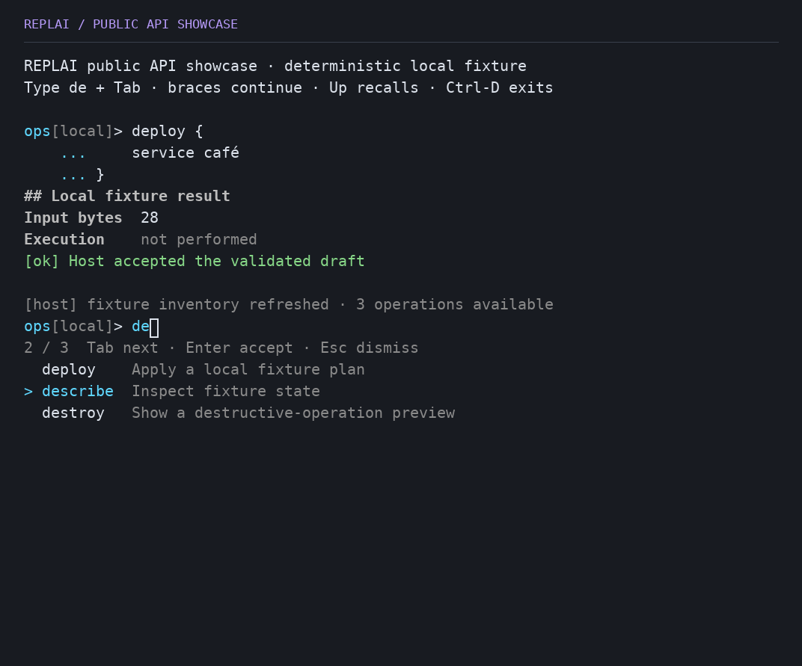
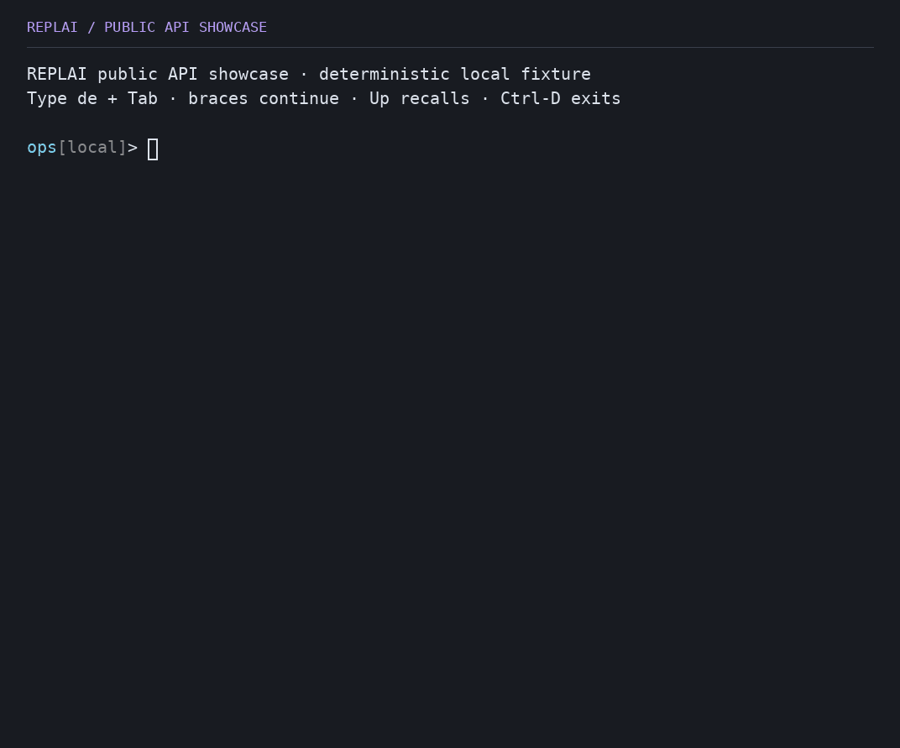
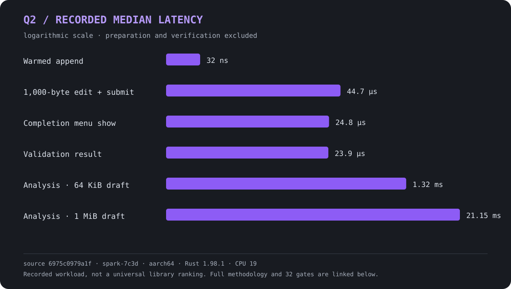

<p align="center">
  
  
  <br>
  <strong>The application owns the language.<br>REPLAI owns the line.</strong>
</p>
<p align="center">
  An embeddable terminal interaction engine for Rust and C.<br>
  Parsing, command semantics, execution, persistence and scheduling remain host-owned.
</p>
<p align="center">
  <a href="docs/interaction.md"></a>
  <a href="docs/c-api.md"></a>
  <a href="docs/architecture.md"></a>
  <a href="ROADMAP.md"></a>
  <a href="https://github.com/mothx9/replai/actions/workflows/ci.yml"></a>
  <a href="LICENSE"></a>
</p>

<p align="center">
  <a href="#quick-start">Quick Start</a> · <a href="#choose-your-integration">Choose a mode</a> ·
  <a href="#capabilities">Capabilities</a> · <a href="#how-it-works">Architecture</a> ·
  <a href="#platform-support">Support</a> · <a href="#performance">Performance</a> ·
  <a href="#documentation">Docs</a>
</p>

## At a glance

REPLAI provides Unicode editing, revision-safe host analysis, rich completion,
validated multiline interaction, structured presentation and explicit terminal
lifecycle management. It occupies a useful middle layer: the host can begin with
a small line read, then adopt session or driven control without moving its
language or event loop into a terminal framework.

- **Rust:** Blocking · Session · Driven. **C/C++:** ABI 1 session.
- **Runtime:** Linux GNU x86_64/ARM64 · macOS ARM64. **Portable core:** Windows x86_64.
- **Ownership:** the host keeps parsing, semantics, execution, persistence and scheduling;
  REPLAI owns editing, terminal lifecycle, revision provenance and generic presentation.
- **License:** MIT.

## Real showcase

<p align="center">
  
</p>

Real PTY, public APIs, deterministic local fixture. The host supplies operation
names, analysis and validation; REPLAI preserves the draft, cursor and completion
selection while host output arrives.

<details>
<summary><strong>Watch the 11.63-second interaction</strong></summary>

<p align="center">
  
</p>

The animation comes from the same executable and real PTY. It is illustrative;
it is not benchmark evidence. The static image above contains the essential
information without motion. [Capture and asset provenance](docs/development.md#public-readme-assets).

</details>

## Interface examples

The same public surface can support a data-oriented console or render structured
output without an active editor. Both captures below come from deterministic
local fixtures; neither contacts a database or build service.

<p align="center">
  
</p>

An interactive query console: host-owned commands and records, REPLAI-owned
editing, results layout and draft restoration.

<p align="center">
  
</p>

A standalone `Document`: headings, facts, status, tabular data and help rendered
without raw ANSI. [Reproduce the focused captures](docs/development.md#readme-terminal-preview).

## Quick Start

On Linux or macOS, with Git and a current stable Rust toolchain:

```sh
git clone https://github.com/mothx9/replai.git
cd replai
cargo run --locked --example showcase
```

Try `de`, Tab, Tab, then wait for the host notice. Enter accepts the selected
candidate; another Enter validates and submits. Type `deploy {`, press Enter,
Tab-indent `service café`, close with `}` and press Enter. Up recalls the exact
multiline entry. Ctrl-D on an empty draft exits.

The showcase executes no command and contacts no service. Its fixture owns all
operation meanings. If `cargo` is missing, install Rust with
[rustup](https://rustup.rs/) first. More paths are mapped in
[use-case recipes](docs/use-cases.md).

## Choose your integration

| Your application | REPLAI mode | Host responsibility | Typical fit | Start here |
| --- | --- | --- | --- | --- |
| Read → execute → read | **Blocking** | Execute each submitted line | Deterministic CLI, turn-by-turn chat | [simple.rs](examples/simple.rs) · [contract](docs/interaction.md#embedding-tiers-and-wait-ownership) |
| Rich interactive console | **Session** | Poll and handle events/results | Database, debugger, admin console | [showcase.rs](examples/showcase.rs) · [contract](docs/interaction.md#embedding-tiers-and-wait-ownership) |
| Existing event loop | **Driven** | Reactor, readiness and scheduling | Network client, debugger, model frontend | [driven.rs](examples/driven.rs) · [contract](docs/interaction.md#embedding-tiers-and-wait-ownership) |
| C/C++ process | **C ABI 1 session** | Semantics and polling loop | Native tools and existing C systems | [demo.c](examples/c/demo.c) · [contract](docs/c-api.md) |

Blocking keeps the smallest host small. Session exposes the interaction event
boundary. Driven lets an existing reactor wait on terminal readiness, REPLAI
deadlines and application events. None of these modes gives REPLAI ownership of
application threads, signals or command execution.

## Capabilities

The matrix makes the intentional Rust/C asymmetry explicit. “Replacement only”
means ABI 1 can apply a host-selected synchronous replacement but has no candidate
set/menu contract.

| Capability | Rust | C ABI 1 | Host-owned part |
| --- | --- | --- | --- |
| Unicode/grapheme editing | 🟢 Qualified | 🟢 Qualified | Accepted input policy |
| In-memory history navigation | 🟢 Qualified | 🟢 Qualified | Admission and persistence |
| Rich completion UI | 🟢 Qualified | 🟡 Replacement only | Discovery, order and ranking |
| Revision snapshots / stale refusal | 🟢 Qualified | 🔴 Outside ABI 1 | Analysis meaning and schedule |
| Validated multiline | 🟢 Qualified | 🔴 Outside ABI 1 | Grammar and diagnostics |
| Host spans / non-canonical hints | 🟢 Qualified | 🔴 Outside ABI 1 | Classification and hint text |
| Structured documents | 🟢 Qualified | 🔴 Outside ABI 1 | Semantic content |
| Coordinated output | 🟢 Plain + documents | 🟡 Plain text only | Output meaning and serialization |
| Blocking / Session / Driven | 🟢 All three | 🟡 Session only | Application execution/reactor |
| Terminal lifecycle | 🟢 Qualified | 🟢 Qualified | Resource choice and call ordering |

All input, candidates, diagnostics, hints and documents are bounded. Rich results
bind to `DraftRevision`; successful text or cursor changes invalidate earlier
analysis automatically.

## Where REPLAI fits

**Good fits:** deterministic CLIs, database and admin consoles, debugger
frontends, model clients, network clients with an existing reactor, and C/C++
command consoles.

**Outside its job:** full-screen dashboards, parsing or shell semantics, secret
entry, and arbitration between independent terminal writers. Driven integrates
with a host event loop; output calls still pass through one serialized owner.

## How it works

<p align="center">
  
  
</p>

The application keeps its parser, state, execution and scheduler. REPLAI's
public blocking, session, driven and C ABI surfaces converge on one interaction
engine, renderer and terminal contract, realized natively on Linux and macOS.

The input pipeline and analysis pipeline are independent ownership paths:

```text
input bytes → decoder → normalized action → editor/interaction → layout/damage → effects

draft N → immutable snapshot → HOST ANALYSIS → result @ N → current?
                                                        ├─ no  → Stale
                                                        └─ yes → present/apply
```

A stale result cannot mutate the draft or emit presentation. Resize and serialized
host output do not change the draft revision, so current presentation can be
laid out and restored without asking the host to parse again.

### Component map

- **`Editor`** owns the bounded UTF-8 draft, grapheme edits, history mechanics
  and `DraftRevision` without requiring a terminal.
- **Analysis contracts** own immutable snapshots, stale checks and bounded
  completion, validation and presentation structures.
- **`Interaction`** gives blocking, session and driven hosts one lifecycle and
  one serialized mutation boundary.
- **Presentation** turns safe prompts, completion, diagnostics, hints and
  documents into shared layout and render damage.
- **The terminal contract** owns admission, decoding, readiness, geometry and
  restoration; Linux and macOS provide the native resource realization.
- **C ABI 1** adapts the same engine through opaque handles at its documented,
  deliberately smaller surface.

`Editor` is terminal-independent. Frames, decoder state and terminal mutations
remain private. The [architecture contract](docs/architecture.md) maps these
responsibilities to source owners; `cargo doc --no-deps` renders method-level API
documentation.

## Installation

### Rust from the qualified checkpoint

Until crates.io publication, pin the latest qualified public producer checkpoint:

```toml
[dependencies]
replai = { git = "https://github.com/mothx9/replai", rev = "30ef4f4ac6deeb07ffa0b9adb2071b070f4129e3" }
```

This exact checkpoint carries the qualified runtime and current hardening
evidence. Exact Git pins keep pre-release consumption deliberate; no crates.io
package has been published yet.

A current stable Rust toolchain is used today. The unpublished 0.1.0 candidate
declares Rust 1.98.1 as its MSRV. Runtime dependencies
are `unicode-segmentation`, `unicode-width`, `rustix` on Linux/macOS and `nix` for
macOS waiting. There is no daemon, background process or required async runtime.

## Rust integration

### Blocking

The smallest real host remains small:

```rust
use replai::{Editor, Interaction, Prompt, ReadOutcome};

fn main() -> Result<(), Box<dyn std::error::Error>> {
    let mut input = Interaction::new(Editor::new(65_536, 100));
    loop {
        match input.read_line(Prompt::new("demo")?)? {
            ReadOutcome::Submitted(text) => println!("received: {text}"),
            ReadOutcome::Interrupted => {},
            ReadOutcome::EndOfInput => break,
        }
        input.editor_mut()?.clear();
    }
    Ok(())
}
```

The terminal is restored before `read_line` returns. The host decides what to do
with submission, interrupt and EOF. The [complete blocking example](examples/simple.rs)
also admits history explicitly.

### Session

```text
open → poll → host handles event
         ↑             │
         └─ result / output

submit / interrupt / EOF / close → restored terminal
```

A session can deliver completion, validation, analysis presentation and
serialized output while the editor stays active. `poll(Duration)` is a convenience
scheduler with bounded resize observation. The [public showcase](examples/showcase.rs)
is the canonical session example; [demo.rs](examples/demo.rs) is smaller.

### Driven

```text
terminal readiness ─┐
network result ─────┤
resize notification ┤
REPLAI deadline ────┘ → host reactor → serialized Interaction calls
```

Use `open_driven` or `open_with_config`, then inspect `wait_interest()` and
`input_source()`. Deliver `advance(Wake::InputReady)`, `advance(Wake::Resize)` or
`advance(Wake::Deadline(token))`, refreshing interest after each operation.
The [driven example](examples/driven.rs) owns the wait. With no readiness or
deadline, REPLAI requires no periodic wake. No Tokio or signal handler is required.

## Host analysis

One `AnalysisSnapshot` contains coherent text, cursor and revision. It can leave
the interaction while the host parses once and derives completion, validation
and presentation independently. REPLAI owns provenance and safe application;
the host owns meaning, context, cadence and cancellation.

### Completion

A session receives `Event::CompletionRequested`; the host returns ordered
candidates whose display label, annotation and insertion text may differ:

```rust
use replai::{AnalysisOutcome, CompletionCandidate, CompletionError, CompletionSet, Interaction};

fn offer_build(input: &mut Interaction) -> Result<AnalysisOutcome, CompletionError> {
    let snapshot = input.analysis_snapshot();
    let candidate = CompletionCandidate::new(0..snapshot.text().len(), "build ", "build")?
        .with_annotation("Build the project")?;
    input.present_completions(CompletionSet::new(snapshot.revision(), vec![candidate])?)
}
```

Tab/arrow navigation does not change `DraftRevision`; Enter accepts the candidate
before a later Enter can submit. Delayed stale sets produce no menu, terminal
bytes or draft mutation. [Runnable completion](examples/completion.rs) ·
[contract](docs/interaction.md#revision-bound-completion-candidates).

### Validation and multiline

With `SubmissionPolicy::Validated`, Enter creates a revision-bound request:

```text
SubmissionRequested(snapshot) → HOST
  Complete   → submit the exact validated revision
  Incomplete → insert newline and continue
  Invalid    → retain draft and show safe diagnostics
```

The delivery path stays small:

```rust
use replai::{AnalysisSnapshot, Interaction, ValidationDisposition, ValidationError,
             ValidationOutcome, ValidationResult};

fn return_decision(input: &mut Interaction, request: AnalysisSnapshot,
                   decision: ValidationDisposition) -> Result<ValidationOutcome, ValidationError> {
    input.apply_validation(ValidationResult::new(request.revision(), decision)?)
}
```

A stale decision cannot submit, insert a newline or display a diagnostic. REPLAI
owns continuation layout, multiline vertical navigation and Tab indentation in
continuation whitespace; the host owns grammar. [Runnable validator](examples/validation.rs) ·
[contract](docs/interaction.md#validated-submission-and-multiline-navigation).

### Analysis presentation

`AnalysisPresentation` carries ordered, non-overlapping `AnalysisSpan` ranges and
an optional `Hint` at one revision. The host classifies text into generic roles;
REPLAI never recognizes a keyword, command or path.

A hint is visible as `[~…]` but is never editor text, history or submitted input.
It is suppressed while completion is open and returns after dismissal if still
current. Insertion continues through completion or revision-bound replacement.
Plain mode drops color-only spans while retaining explicit non-canonical hint
markers. [Runnable analysis](examples/analysis-presentation.rs) ·
[contract](docs/interaction.md#editor-analysis-presentation).

## Presentation

Interactive presentation covers prompts, continuations, completion, diagnostics
and hints. Structured documents cover headings, facts, lists, responsive tables,
status and literal blocks. The host supplies safe structure rather than ANSI or
manually padded columns:

```rust
use replai::{Block, Document, Severity, Text, Theme};

fn main() -> Result<(), Box<dyn std::error::Error>> {
    let document = Document::new(vec![
        Block::Heading { level: 1, text: Text::new("Workspace")? },
        Block::KeyValue(vec![(Text::new("Mode")?, Text::new("local")?)]),
        Block::Status { severity: Severity::Success, text: Text::new("Ready")? },
    ])?;
    print!("{}", document.render(60, Theme::new(false, false, None))?);
    Ok(())
}
```

```text
# Workspace
Mode  local
[ok] Ready
```

`Interaction::output_document` uses the same model while editing, then restores
the exact current interactive surface. Narrow tables become stacked records;
NO_COLOR retains structural labels. [Structured example](examples/structured.rs) ·
[report](examples/report.rs) · [contract](docs/presentation.md).

## C / C++ integration

C ABI 1 exposes opaque handles, explicit events and caller-owned UTF-8 copy
buffers. It uses the same engine. A polling excerpt:

```c
#include "replai.h"

replai_status next_event(replai_handle *input, replai_event *event) {
    replai_status status;
    do {
        *event = (replai_event){.struct_size = sizeof *event,
                               .abi_version = REPLAI_C_ABI_VERSION};
        status = replai_poll(input, 100, event);
    } while (status == REPLAI_OK && event->kind == REPLAI_EVENT_NONE);
    return status;
}
```

Build staged static/shared artifacts and the [complete C host](examples/c/demo.c):

```sh
cargo build --locked --release -p replai-c
python3 tools/stage_c.py --prefix /tmp/replai-install
export PKG_CONFIG_PATH=/tmp/replai-install/lib/pkgconfig
cc examples/c/demo.c $(pkg-config --cflags --libs replai) \
  -Wl,-rpath,/tmp/replai-install/lib -o /tmp/replai-demo
/tmp/replai-demo
```

Use an absent or empty staging directory. Installed consumers need a C/C++
toolchain and staged artifacts, not Rust or a checkout. ABI 1 provides session
polling, synchronous replacement, direct submission, prompts and plain coordinated
output. Rich candidates, revisioned analysis, validation, documents and driven
embedding remain Rust-native. [C installation and ABI contract](docs/c-api.md).

## Platform support

This is the **candidate v0.1 envelope**, not a published release claim.

| Target | Rust terminal | C ABI 1 | Qualification status |
| --- | --- | --- | --- |
| Linux GNU x86_64 | Blocking / Session / Driven | Static + shared | 🟢 Qualified release target; real PTY + Valgrind |
| Linux GNU ARM64 | Blocking / Session / Driven | Static + shared | 🟢 Qualified release target; native real PTY + Valgrind |
| macOS ARM64 | Blocking / Session / Driven | Static + dylib | 🟢 Qualified release target; native real PTY + leaks |
| Windows x86_64 | Portable models only | No terminal adapter | ⚪ Portable only; **no terminal backend** |
| macOS Intel | Source may compile | Unqualified | 🟡 Not release-qualified |
| Linux musl / other targets | Source portability only | Unqualified | 🟡 Not release-qualified |

Interactive admission requires matching TTYs, restorable modes, usable dimensions
and required cursor/erase mechanics. Conservative entry points refuse absent or
`TERM=dumb` evidence. `NO_COLOR` is presentation policy. Without admitted
bracketed paste, multiline bytes are ordinary edits and lose paste atomicity.

## Safety and guarantees

- Stale host results cannot mutate a newer draft or emit presentation.
- Invalid host ranges and payloads are rejected before editor mutation; safe
  host text rejects terminal controls.
- Capability mismatches are refused before raw mode where required.
- Serialized external output restores the current draft, cursor and valid
  presentation.
- Drafts, history, candidates, diagnostics, hints and documents have explicit
  bounds.
- One host owns and serializes `Interaction`; close attempts restoration and
  reports cleanup failure through the explicit boundary.

The implementation crate forbids unsafe Rust. FFI unsafety is confined to the
adapter and its documented pointer preconditions. This is a memory-safety posture
in addition to the logical contracts above; it is not a security certification.

### Failure behavior

Lifecycle misuse, unsupported capabilities, I/O failure, malformed host data,
stale analysis and capacity exhaustion remain distinct. REPLAI rejects before
mutation when possible, retains the draft after recoverable semantic rejection,
and returns typed `Stale` outcomes for results that are valid but obsolete.
Terminal failures trigger cleanup; explicit close reports restoration failure
where the OS still makes observation possible.

Arbitrary allocator abort, process-wide OOM and SIGKILL recovery are outside the
contract. Exact error taxonomy and recovery rules live in the
[interaction contract](docs/interaction.md).

### Resources and concurrency

Caller descriptors remain caller-owned. REPLAI duplicates terminal resources for
an open interaction, restores/releases those duplicates on close and retains the
editor/history after close. `Drop` attempts cleanup without panicking; explicit
`close` is the reporting boundary. Driven hosts own waiting and resize delivery.

`Interaction` has single-owner serialized mutation semantics. Immutable snapshots
may be analyzed elsewhere while the host continues editing; returned results are
serialized back through revision checks. REPLAI does not promise shared mutable
access or independent stdout/stderr writers.

## Performance

<p align="center">
  
</p>

Representative results from the frozen Q2 registration:

| Recorded workload | Median | p95 | Allocations | Encoded bytes |
| --- | ---: | ---: | ---: | ---: |
| Warmed append, 1 KiB draft | 32 ns | 48 ns | 0 | 0 |
| 1,000-byte edit + submission | 44.7 µs | 45.3 µs | 1,118 | 1,042 |
| Completion menu show | 24.8 µs | 25.2 µs | 161 | 1,312 |
| Validation result | 23.9 µs | 24.3 µs | 123 | 1,235 |
| Analysis presentation, 64 KiB | 1.32 ms | 1.33 ms | 159 | 37 |
| Analysis presentation, 1 MiB | 21.15 ms | 21.18 ms | 159 | 37 |

Source `6975c0979a1fd13f619f2d079b7494945ca18c5e`, runtime tree
`12b9cd0e58ef8d2dfe6c1b91185fd21b05a7aa9e`; Spark ARM64, Linux
6.17.0-1021-nvidia, Rust 1.98.1/LLVM 22.1.8. Five control batches and 31
measured repetitions per batch; allocations use a separate build.
[All 32 workloads, thresholds and methodology](docs/engineering/release-hardening.md#q2-registered-regression-policy).

**These measurements characterize recorded workloads. They are not a universal
ranking of terminal libraries.** Deep-cursor multiline layout still traverses the
prefix; Unicode costs depend on content; serialized host output is synchronous.
Those measured limits remain visible rather than being converted into an SLA.

## Release status and compatibility

REPLAI is an unpublished `0.1.0` candidate. The Rust API is not frozen, C ABI 1 is
qualified at its current bounded scope, and crates.io publication has not
occurred. Consume Rust through the exact Git pin above; the declared and
qualified candidate MSRV is Rust 1.98.1. The candidate v0.1 runtime envelope
is Linux GNU x86_64/ARM64 and macOS ARM64, with Windows portable-core coverage
only. [Release scope](docs/release-scope.md) · [Roadmap](ROADMAP.md).

## Verification

[CI on master](https://github.com/mothx9/replai/actions/workflows/ci.yml) checks the
current source. Exact campaign identities live in engineering dossiers.

| Evidence class | Current coverage |
| --- | --- |
| Native interaction | Real Linux x86_64/ARM64 and macOS ARM64 PTYs, lifecycle/resource stress, restoration and failure paths |
| Adversarial models | Five fuzz targets, 100,000 generated semantic sequences and retained corpus replay |
| Memory and FFI | Linux Valgrind, macOS leaks, ABI layout/symbol checks, static/shared C11 and C++17 consumers |
| Portable core | Windows editor, engine and analysis models; no terminal-runtime inference |
| Public surface | Compiled README snippets, runnable examples, deterministic real-PTY PNG/GIF and Q2 regression checks |

See the [release-hardening dossier](docs/engineering/release-hardening.md) for
campaign identities, budgets and findings, and the [development guide](docs/development.md)
for exact local, native and asset-check commands.

## Scope and non-goals

REPLAI is a line-oriented interaction library. It is not a shell, parser, command
language, full-screen TUI framework, async runtime, application scheduler, history
database, agent framework, secret-entry surface or concurrent terminal-writer
arbiter. These boundaries keep host policy outside the editor.

## Documentation

- **Start:** [examples and use cases](docs/use-cases.md).
- **Integrate:** [Rust interaction/embedding](docs/interaction.md), [C installation and ABI](docs/c-api.md).
- **Present:** [documents, prompts, themes and width](docs/presentation.md).
- **Understand:** [architecture](docs/architecture.md), [documentation owners](docs/README.md).
- **Verify:** [development](docs/development.md), [release hardening](docs/engineering/release-hardening.md).
- **Track:** [roadmap](ROADMAP.md), [release scope](docs/release-scope.md), [changelog](CHANGELOG.md).

Optional [producer metadata](.boundary/README.md) records cross-repository contract
changes. It is not required to build or run REPLAI.

## Contributing

Useful issues include OS, terminal, a minimal reproduction and expected versus
observed behavior. Changes should name the affected boundary and supply evidence
when behavior changes. See [CONTRIBUTING.md](CONTRIBUTING.md) or
[open an issue](https://github.com/mothx9/replai/issues).

## License

[MIT](LICENSE).
