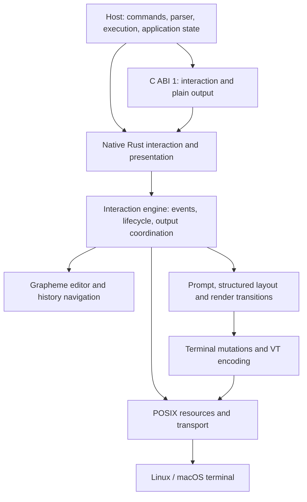

<p align="center">
  
</p>

<h1 align="center">REPLAI</h1>

<p align="center">
  <strong>Embeddable command-line interaction.</strong><br>
  Unicode editing, structured presentation and terminal ownership under your application loop.
</p>

<p align="center">
  <a href="https://github.com/mothx9/replai/actions/workflows/ci.yml"></a> ·
  <a href="LICENSE">MIT</a> ·
  <a href="docs/README.md">Documentation</a> ·
  <a href="examples/demo.rs">Rust</a> ·
  <a href="examples/c/demo.c">C</a>
</p>

REPLAI supplies the interaction substrate for interpreters, database consoles,
debuggers and other command-line applications. It keeps an editable Unicode
draft coherent through history recall, multiline paste, completion, resize and
host output, then restores the terminal when editing ends.

**The host owns commands, parsing, execution and application state. REPLAI owns
editing, interaction, generic presentation and terminal lifecycle.** There is no
shell language, command registry, application scheduler or full-screen UI here.

**Pre-release.** Use an exact revision. The Rust API and C ABI 1 are qualified
experimental contracts, without a stable API/ABI, SemVer or MSRV promise.

## Try it

From a checkout, with a Rust toolchain:

```sh
cargo run --locked --example demo
```

```text
demo> hello
echo: hello

demo>
```

Type `wor` and press Tab for host-selected completion. Submit a line, then use
Up/Down to recall it and return to an unfinished draft. Bracketed multiline paste
stays one input until Enter. Ctrl-C interrupts editing; Ctrl-D exits an empty
prompt or deletes the next grapheme in a nonempty draft.

`cargo run --locked --example demo -- --notice` emits a notice during editing
and restores the draft/cursor. No external application or service is required.

## One engine, explicit ownership



The implementation crate forbids unsafe Rust. The separate C binding adapts the
public Rust API; it does not contain another editor. The terminal retains its
own background and scrollback. [Architecture and boundaries](docs/architecture.md).

| Capability | Implemented contract |
| --- | --- |
| Editing | Bounded UTF-8; extended-grapheme cursor/edit operations; atomic replacement and rejection |
| Interaction | Distinct submit, interrupt, EOF and completion events; explicit close/reopen |
| History and completion | Original-draft restoration; host-owned admission, persistence and candidate selection |
| Input and display | Bounded decoder, atomic bracketed paste, multiline viewport, resize and incremental redraw |
| Presentation | Composed prompts, semantic spans, headings, facts, lists, responsive tables and severity notices; structured API is Rust-native |
| Output and restoration | Safe synchronous output with exact draft/cursor return; captured termios and caller-resource ownership restored |

## Qualified platforms

| Platform | Native Rust terminal | C ABI 1 | Runtime evidence |
| --- | --- | --- | --- |
| Linux | Yes | Static/shared | Real Rust/C PTYs, resource failures and Valgrind |
| macOS | Yes, shared POSIX backend | Static/dylib | Real Rust/C PTYs, native leak checks |
| Windows | **Portable engine/presentation only** | No Windows resource binding | Native deterministic tests; **no terminal backend** |

`NO_COLOR`, `TERM=dumb` and non-TTY output disable styling. Structured plain
output preserves hierarchy and alignment. Interactive operation still requires
the qualified cursor/erase protocol; `TERM=dumb` is not a claim of universal
terminal fallback. See [presentation conditions](docs/presentation.md).

## Measured performance

Published macOS checkpoint: **1000-byte ASCII burst → middle insertion → submit**.

| Implementation | Median |
| --- | ---: |
| REPLAI | 0.194 ms |
| reedline | 0.460 ms |
| rustyline | 0.825 ms |
| linenoise, blocking/feed | 5.869 / 5.899 ms |

**One exact workload, same machine, pinned versions; not a general speed ranking.**
These are the retained qualified checkpoint measurements, not a claim that every
later commit or workload has been rebenchmarked. The
[full dossier](docs/engineering/macos-perf.md#final-same-run-comparisons-and-parity)
records distributions, terminal bytes, environment limits and exact submission/
restoration checks. [Component characterization](docs/engineering/p0.md) separates
editing, layout, encoding, allocations, transport and embedding costs.

## Embed in Rust

The current API is host-driven. A future one-call blocking façade is not yet
implemented. This complete loop reads one input and declines completion:

```rust
use replai::{Editor, Event, Interaction, Prompt, Role};
use std::time::Duration;

fn main() -> Result<(), Box<dyn std::error::Error>> {
    let mut input = Interaction::new(Editor::new(65_536, 100));
    input.open(&std::io::stdin(), &std::io::stdout(), Prompt::new("demo")?)?;
    loop {
        match input.poll(Duration::from_millis(100))? {
            Some(Event::Submitted(text)) => { println!("received: {text}"); break; }
            Some(Event::Interrupted | Event::EndOfInput) => break,
            Some(Event::Rejected(e)) => input.external_output(Role::Warning, &e.to_string())?,
            Some(Event::CompletionRequested) | None => {}
        }
    }
    Ok(())
}
```

Submission restores the terminal before the host processes the text. The
[complete example](examples/demo.rs) adds history admission, completion and
reopen. Build method documentation with `cargo doc --no-deps`.

## Present structure, not padded strings

The host decides what information means; REPLAI decides how generic structure
is represented. One document works in styled terminals and captured plain text:

```rust
use replai::{Block, Document, Severity, Text, Theme};

let document = Document::new(vec![
    Block::Heading { level: 1, text: Text::new("Connection")? },
    Block::KeyValue(vec![
        (Text::new("Endpoint")?, Text::new("http://127.0.0.1:18001")?),
        (Text::new("Mode")?, Text::new("read-only")?),
    ]),
    Block::Status { severity: Severity::Success, text: Text::new("Ready")? },
])?;
print!("{}", document.render(60, Theme::new(false, false, None))?);
```

```text
# Connection
Endpoint  http://127.0.0.1:18001
Mode      read-only
[ok] Ready
```

`Interaction::output_document` presents the same document during editing without
losing the draft. Tables stack records on narrow terminals; lists and fields
wrap by display cells. Prompt segments and continuations share safe spans and
role styling; `Prompt::new("demo")` remains simple.

Try `cargo run --locked --example structured -- 60`, then width `20` or
`NO_COLOR=1`. [The presentation contract](docs/presentation.md) defines control
rejection, work limits, Unicode assumptions and responsive behavior. Concurrent
independent writers and a structured C interface remain outside the current API.

## Embed in C

C ABI 1 provides opaque handles, integer events and caller-owned UTF-8 buffers
over the same engine. Build and stage the native artifacts:

```sh
cargo build --locked --release -p replai-c
python3 tools/stage_c.py --prefix /tmp/replai-install
```

The prefix contains `include/replai.h`, static/shared libraries and the `replai`
pkg-config package. Once staged, a consumer needs its native toolchain and those
artifacts, without Cargo or Rust source access.
[Installation, linkage and ownership](docs/c-api.md) · [Complete C host loop](examples/c/demo.c).

## Evidence and integration contracts

[CI](https://github.com/mothx9/replai/actions/workflows/ci.yml) separates Rust,
real PTYs, C layout/symbols, isolated static/shared consumers, memory tools and
portable benchmark integrity. Tests observe UTF-8 bytes, terminal cells/cursor,
termios equality and descriptor ownership rather than relying on demo output.

[Architecture](docs/architecture.md) · [Presentation](docs/presentation.md) ·
[Linux/macOS evidence](docs/engineering/macos-perf.md) ·
[Roadmap](ROADMAP.md) · [Documentation map](docs/README.md).

For downstream coordination, the optional
[machine-readable producer contract](.boundary/producer.json) publishes exact
source identities, capabilities and their deltas. [Contract discovery and
provenance](.boundary/README.md) explains the metadata boundary. BOUNDARY is not
a runtime or build dependency, and consumers need not adopt it to use REPLAI.

[MIT License](LICENSE).
