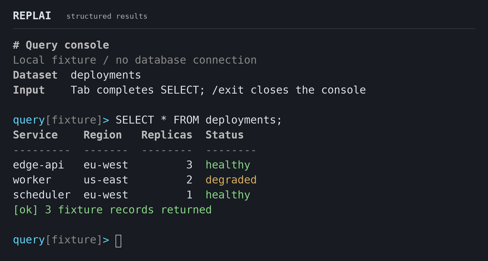
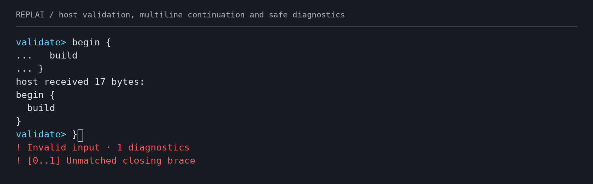
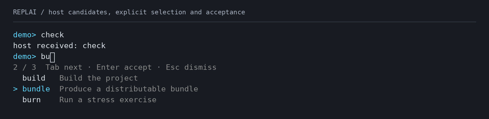
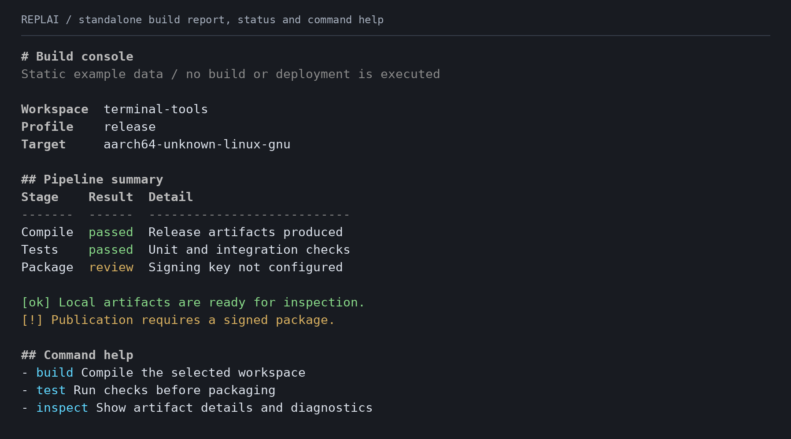
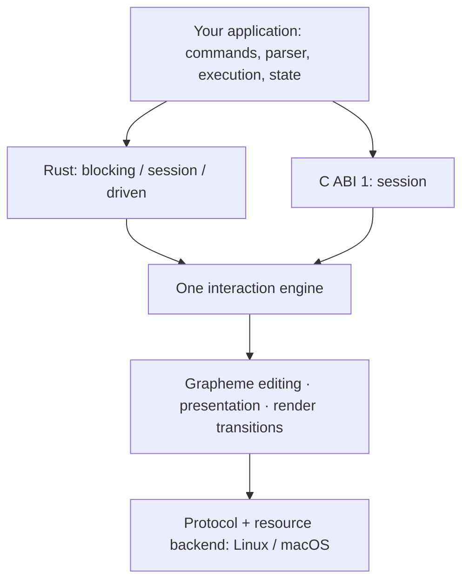

<p align="center">
  
</p>

<h1 align="center">REPLAI</h1>

<p align="center">
  <strong>Command-line infrastructure for Rust and C.</strong><br>
  Unicode input, structured presentation and terminal lifecycle.<br>
  One interaction engine. Three levels of integration.
</p>

<p align="center">
  <a href="https://github.com/mothx9/replai/actions/workflows/ci.yml"></a>
  <a href="LICENSE"></a>
  <a href="Cargo.toml"></a>
  <a href="#rust"></a>
  <a href="#c-and-c"></a>
  <a href="#platform-support"></a>
</p>

<p align="center">
  <a href="#quick-start">Quick start</a> ·
  <a href="#choose-your-integration">Integration</a> ·
  <a href="#structured-presentation">Presentation</a> ·
  <a href="docs/README.md">Documentation</a> ·
  <a href="ROADMAP.md">Roadmap</a>
</p>

REPLAI is an embeddable terminal interaction library for developer tools,
application consoles and operational command interfaces. It combines editable
input, terminal-aware presentation and explicit resource ownership under the
application's control.

Use it to build database consoles, debugger frontends, administration tools and
model clients. Your application defines the language and execution model; REPLAI
provides the interaction layer.

<p align="center">
  
</p>

## What you get

| Capability | Integration value |
| --- | --- |
| **Unicode editing** | Grapheme-aware movement and deletion, bounded drafts and atomic bracketed paste when admitted by terminal policy |
| **History and completion** | Exact draft restoration; host-ordered candidates with safe revision binding, selection and acceptance |
| **Structured presentation** | Headings, aligned fields, lists, responsive tables and status messages from safe semantic text |
| **Coordinated output** | Present results or notices during editing, then restore the draft and cursor exactly |
| **Flexible embedding** | Blocking, explicit session and host-driven integration over the same engine; no required async runtime |
| **Explicit terminal contracts** | Inspectable capabilities, deliberate degradation, typed outcomes and qualified restoration of terminal state |

REPLAI operates in normal terminal scrollback and preserves the terminal's
background. Commands, parsing, execution, application state and persistence remain
host-owned. The library supplies line-oriented interaction rather than a shell or
full-screen application framework.

## Quick start

Run the query-console example on **Linux or macOS** with Git and a current stable
Rust toolchain:

```sh
git clone https://github.com/mothx9/replai.git
cd replai
cargo run --locked --example query -- --notice
```

Type `SEL`, press **Tab**, then **Enter**. The example completes a fixed query and
renders a local fixture dataset; it requires no database, credentials or service.
The [complete host](examples/query.rs) shows completion, history admission,
structured results and coordinated output through the public API.

| Interaction | Behavior to explore |
| --- | --- |
| Up / Down after typing a draft | Navigate history and return to the original draft |
| Left / Right / Backspace | Edit at grapheme boundaries |
| Paste `SELECT *` and `FROM deployments;` on separate lines | Edit one multiline draft before submission |
| Keep a draft open for two seconds | A host notice arrives above the restored input |
| Ctrl-L | Redraw the current interaction |
| Ctrl-C / Ctrl-D on empty input | Interrupt editing / return EOF to the host |
| `/exit` | Close this example |

For a minimal blocking host or standalone presentation:

```sh
cargo run --locked --example simple
cargo run --locked --example report
cargo run --locked --example structured -- 68
NO_COLOR=1 cargo run --locked --example structured -- 24
```

## Use-case map

| Build | Start here | What stays in your application |
| --- | --- | --- |
| Small deterministic CLI | `cargo run --locked --example simple` | Commands, evaluation and history admission |
| Rich command console | `cargo run --locked --example completion` | Candidate discovery, meaning and order |
| Validated multiline console | `cargo run --locked --example validation` | Grammar and Complete/Incomplete/Invalid decisions |
| Turn-by-turn model chat | Blocking input, then host execution | Messages, provider calls, streaming and cancellation |
| Chat/debugger with external events | `cargo run --locked --example driven` | Reactor, network/timer events and serialized output calls |
| Reports or captured output | `cargo run --locked --example report` | Data and semantic classification |

The examples run locally without a database or model. In `validation`, type `{`,
Enter, `task`, Enter, `}`, Enter: the host receives one multiline statement.
Invalid input keeps the draft and shows safe diagnostics; delayed decisions for
an edited draft are refused. Completion acceptance and submission are separate.

<p align="center">
  
</p>

[Runnable recipes, keybindings and terminal configurations](docs/use-cases.md)
cover application embedding and developer verification, including NO_COLOR,
narrow output, real PTYs and native memory checks.

## Choose your integration

| Integration | Public entry points | Application responsibility |
| --- | --- | --- |
| **Blocking** | `Interaction::read_line` | Receive submitted input, interruption or EOF; run application logic |
| **Session** | `open`, `poll`, `complete`, `close` | Dispatch events, resolve completion and coordinate output |
| **Driven** | `wait_interest`, `advance` | Own the reactor; deliver readiness, deadlines and resize notifications |

Start with the level your application needs. Each tier shares editor semantics,
presentation and terminal acquisition/restoration. The driven tier integrates
with application sockets, timers and event sources through borrowed POSIX
readiness. With no pending deadline or external event, it requires no periodic
REPLAI wake.

Output operations remain serialized by the host. Compatibility `poll` retains
periodic resize observation; driven hosts provide resize notifications. REPLAI
installs no signal handlers and owns no background writer or application scheduler.

[Blocking example](examples/simple.rs) · [Session example](examples/demo.rs) ·
[External-loop example](examples/driven.rs) ·
[Embedding contract](docs/interaction.md#embedding-tiers-and-wait-ownership)


### Rust

Integrate the native API through Cargo using an exact Git revision. This qualified
checkpoint includes the three embedding tiers, structured presentation, rich
completion, validated multiline input and explicit terminal capabilities:

```toml
[dependencies]
replai = { git = "https://github.com/mothx9/replai", rev = "1da4dbf9162a2fea4d267e1aa473859ee64ae290" }
```

A retained interaction provides a complete blocking input loop:

```rust
use replai::{Editor, Interaction, Prompt, ReadOutcome};

fn main() -> Result<(), Box<dyn std::error::Error>> {
    let mut input = Interaction::new(Editor::new(65_536, 100));
    loop {
        match input.read_line(Prompt::new("demo")?)? {
            ReadOutcome::Submitted(text) => {
                println!("received: {text}"); // Your application runs here.
                if !text.is_empty() {
                    input.editor_mut()?.admit_history(&text)?;
                }
                input.editor_mut()?.clear();
            }
            ReadOutcome::Interrupted => input.editor_mut()?.clear(),
            ReadOutcome::EndOfInput => break,
        }
    }
    Ok(())
}
```

The terminal is restored before `read_line` returns. An editing interrupt is a
typed result; the application decides whether it affects execution. Applications
that require completion or coordinated output use the session or driven tier.

[Native API and lifecycle](docs/interaction.md) ·
Generate local API documentation with `cargo doc --no-deps --open`.

Retain a draft snapshot for application-owned analysis, then apply its replacement
with `complete_at(snapshot.revision(), range, text)`. If editing has advanced,
REPLAI returns `AnalysisOutcome::Stale` without touching the draft or screen.
Snapshots share immutable text when cloned; REPLAI never owns your parser or
analysis scheduler. See the [analysis contract](docs/interaction.md#revision-aware-host-analysis)
and [driven fixture](examples/analysis.rs).

### Rich completion

Your application discovers and orders candidates from one immutable draft snapshot.
REPLAI validates the revision, presents the choices and applies the accepted
replacement. Delayed results for an older draft leave the screen untouched.

```sh
cargo run --locked --example completion
```

Type `bu`, press Tab, then use Tab / Shift-Tab to select, Enter to accept or Escape
to dismiss. The [small session host](examples/completion.rs) owns the catalog;
the [driven example](examples/completion-driven.rs) demonstrates delayed delivery.
Labels, annotations and inserted text may differ.

<p align="center">
  
</p>

[Candidate lifecycle, safety and bounds](docs/interaction.md#revision-bound-completion-candidates).
Rich completion is native Rust; C ABI 1 retains synchronous replacement.

### C and C++

C ABI 1 provides opaque handles, explicit event/status values and caller-owned
UTF-8 buffers over the same native engine. The qualified interface supports
session interaction, prompt configuration and plain coordinated output.
Structured documents, blocking/driven entries and capability snapshots are
currently native Rust surfaces.

Stage a header, static/shared library and pkg-config metadata into an absent or
empty prefix:

```sh
cargo build --locked --release -p replai-c
python3 tools/stage_c.py --prefix /tmp/replai-install
export PKG_CONFIG_PATH=/tmp/replai-install/lib/pkgconfig
cc examples/c/demo.c $(pkg-config --cflags --libs replai) \
  -Wl,-rpath,/tmp/replai-install/lib -o /tmp/replai-demo
/tmp/replai-demo
```

Artifact production requires Rust and Python 3. An installed C/C++ consumer uses
its native toolchain and the staged artifacts, without Cargo or access to REPLAI
sources. The qualification suite checks both linkage modes and C++ inclusion.

[Installation, static linkage and ABI ownership](docs/c-api.md) ·
[Complete C host](examples/c/demo.c)

## Structured presentation

Give terminal output a consistent hierarchy without writing ANSI sequences or
padding columns in application code. A `Document` describes generic structure;
REPLAI resolves cell geometry, wrapping, semantic styling and narrow-width layout.

<p align="center">
  
</p>

| Primitive | Presentation contract |
| --- | --- |
| Headings and spans | Hierarchy and inline emphasis using semantic roles |
| Key/value fields | Label alignment, wrapped values and narrow-layout fallback |
| Lists | Ordered/unordered items with bounded nesting |
| Tables | Unicode cell alignment and stacked records when columns no longer fit |
| Status and literal blocks | Severity remains visible without color; literal data stays safe |
| Composed prompts | Styled context segments and multiline continuation |

The same document can render to a styled terminal, plain captured output or an
active interaction. `NO_COLOR` preserves structure. The host determines the
meaning of a result, warning or status; REPLAI determines its generic terminal
representation.

<details>
<summary><strong>Rust example: render a connection summary</strong></summary>

```rust
use replai::{Block, Document, Severity, Text, Theme};

fn main() -> Result<(), Box<dyn std::error::Error>> {
    let document = Document::new(vec![
        Block::Heading { level: 1, text: Text::new("Connection")? },
        Block::KeyValue(vec![
            (Text::new("Endpoint")?, Text::new("http://127.0.0.1:18001")?),
            (Text::new("Mode")?, Text::new("read-only")?),
        ]),
        Block::Status { severity: Severity::Success, text: Text::new("Ready")? },
    ])?;
    print!("{}", document.render(60, Theme::new(false, false, None))?);
    Ok(())
}
```

Use `Interaction::output_document` to present the same document during editing
and restore the exact draft/cursor afterward. The host determines what counts
as a warning or a success; REPLAI lays out its generic representation.

</details>

Host text is validated against the safe-text contract. Structured values cannot
inject terminal commands. Width follows the explicit UnicodeNarrow policy;
actual emulator/font behavior can differ for ambiguous-width and emoji sequences.

[Presentation, theme configuration and resource limits](docs/presentation.md)

## Platform support

| Platform | Interactive Rust | C ABI 1 | Executed qualification |
| --- | --- | --- | --- |
| **Linux** | Blocking, session, driven | Static/shared | Real PTYs, external reactor, exact restoration and Valgrind |
| **macOS** | Blocking, session, driven | Static/dylib | Real PTYs, external reactor, exact restoration and native leak checks |
| **Windows** | Portable engine/presentation | No runtime binding | Native deterministic tests; no terminal backend |

Terminal admission separates observed resource facts, protocol assumptions,
required mechanics and optional styling/paste policy. Hosts can inspect the
resolved contract through `Interaction::capabilities()`.

Environment-based interactive defaults refuse unknown or `TERM=dumb` terminals
before raw mode; `NO_COLOR` disables styling. The session/C compatibility path
retains its explicit VT assumptions. Standalone documents remain usable with
non-TTY output. [Capability and degradation contract](docs/interaction.md#terminal-capabilities)

**Distribution status:** pre-release, MIT licensed, available through pinned Git
source and staged C artifacts. Rust APIs and C ABI 1 have executable qualification;
there is no public API freeze, long-term ABI/SemVer commitment, declared MSRV or
crates.io release yet. The [roadmap](ROADMAP.md) defines the release path.

## Performance

Performance is characterized across editor transitions, layout, rendering,
encoding, allocations and terminal transport. The retained same-machine macOS
comparison uses **1000-byte ASCII burst → middle insertion → submission**:

| Implementation | Median |
| --- | ---: |
| **REPLAI** | **0.194 ms** |
| reedline | 0.460 ms |
| rustyline | 0.825 ms |

These are exact-workload measurements at pinned checkpoints, not a general speed
ranking or a new benchmark of every commit.
[Methodology, distributions and comparisons](docs/engineering/macos-perf.md#final-same-run-comparisons-and-parity)

The F2 component comparison observed unchanged allocation profiles, allocation-free
capability resolution and no systematic steady-state slowdown. Driven idle adds
no periodic library wake; admission is resolved at acquisition rather than per key.
[Capability measurements](docs/engineering/terminal-capabilities.md#performance-boundaries) ·
[Embedding measurements](docs/engineering/embedding.md) ·
[Component methodology](docs/engineering/p0.md)

## Architecture



Application semantics stay above the public contract. Editor, layout and
interaction state are platform-neutral; resource management and terminal protocol
serialization have separate owners. The implementation crate forbids unsafe Rust.
FFI unsafety is confined to the C adapter, which uses the native public API.

[Architecture and ownership](docs/architecture.md)

## Documentation and quality

[CI](https://github.com/mothx9/replai/actions/workflows/ci.yml) verifies portable
behavior and native terminal operation. Its observations include exact draft and
cursor state, terminal restoration, descriptor ownership, error cleanup, ABI
layouts/symbols and isolated installed consumers. Linux Valgrind and macOS native
leak checks complement the Rust, C and PTY gates.

| Resource | Scope |
| --- | --- |
| [Documentation map](docs/README.md) | Contract and implementation authorities |
| [Interaction](docs/interaction.md) | Embedding, events, lifecycle and capabilities |
| [Presentation](docs/presentation.md) | Documents, themes, geometry and bounds |
| [C API](docs/c-api.md) | Installation, linkage and ABI ownership |
| [Development](docs/development.md) | Reproducible builds and qualification |
| [Roadmap](ROADMAP.md) · [Changelog](CHANGELOG.md) | Maturity, release progression and contract evolution |

The screenshots come from the runnable query host in a real Linux PTY.
[Capture method](docs/development.md#readme-terminal-preview).

For multi-repository integration, optional [producer metadata](.boundary/producer.json)
publishes exact capability snapshots and deltas through BOUNDARY. It adds no build
or runtime dependency and does not assign consumer migrations. Applications retain
control of their pins and adoption decisions. [Contract discovery](.boundary/README.md)

## Contributing

Report issues with the operating system, terminal, reproduction steps and expected
versus observed behavior. Focused changes should include evidence at the affected
contract boundary.

[Contribution guide](CONTRIBUTING.md) ·
[Issue tracker](https://github.com/mothx9/replai/issues) · [MIT license](LICENSE)
