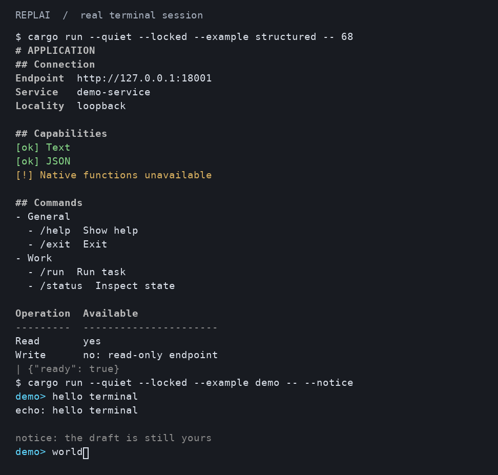
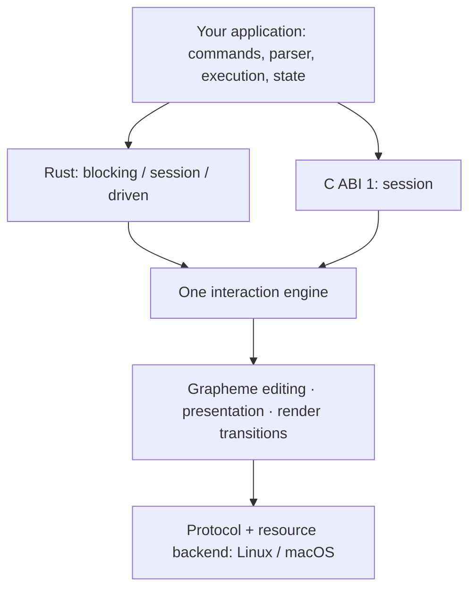

<p align="center">
  
</p>

<h1 align="center">REPLAI</h1>

<p align="center">
  <strong>Terminal interaction for Rust and C.</strong><br>
  Unicode editing, structured output and a prompt that stays yours.<br>
  Start with a blocking read. Grow into your own event loop.
</p>

<p align="center">
  <a href="https://github.com/mothx9/replai/actions/workflows/ci.yml"></a>
  <a href="LICENSE"></a>
  <a href="Cargo.toml"></a>
  <a href="#rust"></a>
  <a href="#c-and-c"></a>
  <a href="#platform-support"></a>
</p>

<p align="center">
  <a href="#quick-start">Quick start</a> ·
  <a href="#choose-your-integration">Integration</a> ·
  <a href="#structured-presentation">Presentation</a> ·
  <a href="docs/README.md">Documentation</a> ·
  <a href="ROADMAP.md">Roadmap</a>
</p>

REPLAI gives command-line applications an editable input surface and a shared
presentation vocabulary. Build a small interactive tool, a database console,
a debugger frontend or a model client while keeping commands, execution and
application state in your own code.

<p align="center">
  <a href="assets/terminal-preview.png"></a>
</p>

<p align="center"><em>Real output from the structured and session examples. Click for full resolution.</em></p>

## What you get

- **Unicode-aware editing.** Move and delete by extended grapheme, including
  combining characters, CJK and joined emoji. Paste multiline input atomically.
- **A draft that survives.** Recall history and return to the original draft and
  cursor. Print host output during editing, then restore the input surface.
- **Three ways to embed.** A blocking read, an explicit session or an externally
  driven interaction, all using the same editor, renderer and terminal lifecycle.
- **Structured terminal output.** Headings, aligned facts, nested lists, responsive
  tables and status messages with semantic inline styles and composed prompts.
- **A terminal-native interface.** Normal scrollback, the terminal's own background,
  width-aware layout and readable plain output when color is disabled.
- **An observable lifecycle.** Typed submission, interrupt and EOF; explicit close,
  exact terminal restoration and qualified descriptor ownership.

The host chooses completions, admits history and decides what submitted text
means. REPLAI handles the interaction mechanics. It supplies neither a command
language nor an application framework.

## Quick start

On **Linux or macOS**, with Git and a current stable Rust toolchain:

```sh
git clone https://github.com/mothx9/replai.git
cd replai
cargo run --locked --example simple
```

```text
simple> hello terminal
echo: hello terminal
simple> /exit
echo: /exit
```

The example echoes input and retains history; it does not execute shell commands.
No model, external service or adjacent project checkout is required.

To reproduce the richer editing session in the preview:

```sh
cargo run --locked --example demo -- --notice
```

| Try | Result |
| --- | --- |
| Type `wor`, then Tab | The host selects `world`; REPLAI applies the completion |
| Submit a line, type a draft, then Up and Down | Return from history to the original unfinished draft |
| Move Left, insert or Backspace | Edit at grapheme boundaries rather than UTF-8 byte offsets |
| Paste several lines | One draft, submitted only when you press Enter |
| Leave a draft while the notice arrives after two seconds | The notice appears above the restored prompt and cursor |
| Ctrl-C, then Ctrl-D on an empty prompt | Interrupt editing, then leave the demo |

Explore presentation and reflow separately:

```sh
cargo run --locked --example structured -- 68
NO_COLOR=1 cargo run --locked --example structured -- 24
```

## Choose your integration

| Your application | Entry point | Host responsibility | Runnable example |
| --- | --- | --- | --- |
| A small interactive tool | `Interaction::read_line` | Handle a typed result; admit history | [Blocking](examples/simple.rs) |
| A command console | `open` / `poll` / `close` | Dispatch events, select completions, emit output | [Session](examples/demo.rs) |
| An existing reactor or event loop | `wait_interest` / `advance` | Wait on readiness, deadlines and application events; notify resize | [Driven](examples/driven.rs) |

Driven idle requires no periodic REPLAI wake when there is no pending deadline.
The host borrows the POSIX input source and retains ownership of waiting and
signals. Compatibility `poll` remains available and retains periodic resize
observation. Output calls are serialized by the host; there are no independent
background writers or required async runtime.
[Embedding and lifecycle contract](docs/interaction.md#embedding-tiers-and-wait-ownership).

### Rust

REPLAI is currently distributed from Git, not crates.io. Pin an exact qualified
revision in your application's `Cargo.toml`; this checkpoint includes all three
embedding tiers and structured presentation:

```toml
[dependencies]
replai = { git = "https://github.com/mothx9/replai", rev = "48bec89820ccc7d142494a66a22ee143cec4e4b2" }
```

A retained interaction is enough for a complete input loop:

```rust
use replai::{Editor, Interaction, Prompt, ReadOutcome};

fn main() -> Result<(), Box<dyn std::error::Error>> {
    let mut input = Interaction::new(Editor::new(65_536, 100));
    loop {
        match input.read_line(Prompt::new("demo")?)? {
            ReadOutcome::Submitted(text) => {
                println!("received: {text}"); // Your application runs here.
                if !text.is_empty() {
                    input.editor_mut()?.admit_history(&text)?;
                }
                input.editor_mut()?.clear();
            }
            ReadOutcome::Interrupted => input.editor_mut()?.clear(),
            ReadOutcome::EndOfInput => break,
        }
    }
    Ok(())
}
```

The terminal is restored before `read_line` returns. Ctrl-C delivers an editing
interrupt; it does not terminate your process or cancel application work.
Completion discovery is available through the session and driven tiers.
[Interaction API](docs/interaction.md) · Generate method documentation with
`cargo doc --no-deps --open`.

### C and C++

C ABI 1 exposes opaque handles, typed integer events and caller-owned UTF-8
buffers over the same engine. It supports the session tier and plain coordinated
output. Structured documents and the new blocking/driven entries are Rust-native.

Build and stage the header, static/shared library and pkg-config metadata from
a checkout. The installation prefix must be absent or empty:

```sh
cargo build --locked --release -p replai-c
python3 tools/stage_c.py --prefix /tmp/replai-install
export PKG_CONFIG_PATH=/tmp/replai-install/lib/pkgconfig
cc examples/c/demo.c $(pkg-config --cflags --libs replai) \
  -Wl,-rpath,/tmp/replai-install/lib -o /tmp/replai-demo
/tmp/replai-demo
```

Building the artifacts requires Rust and Python 3. The installed consumer needs
only its native toolchain, header and libraries; it does not need Cargo or access
to REPLAI sources. C++ inclusion is qualified as part of the ABI checks.
[Static linkage, installation and ownership](docs/c-api.md) ·
[Complete C host](examples/c/demo.c).

## Structured presentation

Describe information once. Render it as styled terminal output or readable plain
text, inside an active interaction or independently of an editor:

```text
# Connection
Endpoint  http://127.0.0.1:18001
Mode      read-only
[ok] Ready
```

| Structure | Terminal behavior |
| --- | --- |
| Headings and semantic spans | Hierarchy and emphasis without host-authored ANSI |
| Key/value facts | Aligned labels, wrapping and narrow-width fallback |
| Ordered and unordered lists | Indentation and bounded nesting |
| Tables | Cell-width alignment; stacked records when columns no longer fit |
| Status and literal blocks | Textual severity cues and safe literal data |
| Composed prompts | Styled segments and continuation using the same text vocabulary |

<details>
<summary><strong>Rust example: build and render this document</strong></summary>

```rust
use replai::{Block, Document, Severity, Text, Theme};

fn main() -> Result<(), Box<dyn std::error::Error>> {
    let document = Document::new(vec![
        Block::Heading { level: 1, text: Text::new("Connection")? },
        Block::KeyValue(vec![
            (Text::new("Endpoint")?, Text::new("http://127.0.0.1:18001")?),
            (Text::new("Mode")?, Text::new("read-only")?),
        ]),
        Block::Status { severity: Severity::Success, text: Text::new("Ready")? },
    ])?;
    print!("{}", document.render(60, Theme::new(false, false, None))?);
    Ok(())
}
```

Use `Interaction::output_document` to present the same document during editing
and restore the exact draft/cursor afterward. The host determines what counts
as a warning or a success; REPLAI lays out its generic representation.

</details>

`NO_COLOR` preserves hierarchy and alignment. Host text is validated against the
safe-text policy; it cannot supply executable terminal controls. Unicode display
width follows the qualified width policy, with emulator-dependent limits.
[Presentation contract, themes and resource bounds](docs/presentation.md).

## Platform support

| Platform | Interactive Rust | C ABI 1 | Qualification |
| --- | --- | --- | --- |
| **Linux** | Blocking, session, driven | Static/shared | Real PTYs, external reactor, restoration and Valgrind |
| **macOS** | Blocking, session, driven | Static/dylib | Real PTYs, external reactor, restoration and native leak checks |
| **Windows** | Portable engine/presentation only | No Windows resource binding | Native deterministic tests; **no terminal backend** |

Simple/driven interactive admission requires a suitable TTY and cursor/erase
capabilities. Environment defaults refuse unknown or `TERM=dumb` terminals
before entering raw mode. `NO_COLOR` disables styling while retaining editing.
Standalone documents can render plain text to non-TTY output; that does not make
a redirected stream an interactive terminal. The existing session/C compatibility
path retains its documented VT assumptions.
[Terminal admission and degradation](docs/interaction.md).

**Pre-release:** Rust and C ABI 1 are qualified experimental contracts. There is
no stable Rust API/ABI, SemVer or MSRV promise yet. New commits do not imply that
existing applications must repin; the [roadmap](ROADMAP.md) owns release progression.

## Performance

Published macOS checkpoint, **1000-byte ASCII burst → middle insertion → submit**:

| Implementation | Median |
| --- | ---: |
| **REPLAI** | **0.194 ms** |
| reedline | 0.460 ms |
| rustyline | 0.825 ms |

One exact workload, same machine, pinned versions; **not a general speed ranking**.
These are retained checkpoint measurements, not a fresh benchmark of every commit.
The [methodology and raw comparisons](docs/engineering/macos-perf.md#final-same-run-comparisons-and-parity)
cover distributions, output bytes and exact submission/restoration checks.
[Embedding measurements](docs/engineering/embedding.md) cover driven idle, resize,
object size and before/after performance; [component benchmarks](docs/engineering/p0.md)
separate editing, layout, encoding, allocations and transport.

## Architecture



The implementation crate forbids unsafe Rust. FFI unsafety is confined to the
separate C adapter, which uses the public native implementation. Terminal
resources and protocol encoding are separated from the portable interaction
engine. [Architecture and ownership](docs/architecture.md).

## Documentation and quality

| Start here | What it answers |
| --- | --- |
| [Documentation map](docs/README.md) | Where to find the authoritative contract for each topic |
| [Interaction](docs/interaction.md) | Input, history, completion, events, embedding and lifecycle |
| [Presentation](docs/presentation.md) | Documents, prompt composition, styling and responsive layout |
| [C API](docs/c-api.md) | ABI 1, staging, linkage and resource ownership |
| [Development](docs/development.md) | Build, test and qualification commands |
| [Roadmap](ROADMAP.md) · [Changelog](CHANGELOG.md) | Current maturity, direction and consumer-visible changes |

[CI](https://github.com/mothx9/replai/actions/workflows/ci.yml) runs portable tests,
real Linux/macOS PTYs, external-loop fixtures, C layout/symbol checks, isolated
static/shared consumers and native memory tools. Qualification observes terminal
cells/cursor, exact text, termios restoration and descriptor lifecycle.
[Linux/macOS evidence](docs/engineering/macos-perf.md) ·
[Embedding evidence](docs/engineering/embedding.md) ·
[Preview capture method](docs/development.md#readme-terminal-preview).

Optional [producer metadata](.boundary/producer.json) describes exact revisions,
capabilities and contract deltas for downstream coordination. BOUNDARY is metadata
tooling, not a runtime or build dependency. Consumers own their adoption decisions.
[Contract discovery](.boundary/README.md).

## Contributing

Bug reports are most useful with the operating system, terminal, reproduction
steps and observed versus expected text/cursor behavior. See the
[contribution guide](CONTRIBUTING.md), [open an issue](https://github.com/mothx9/replai/issues)
or propose a focused change with executable evidence.

REPLAI is [MIT licensed](LICENSE).
