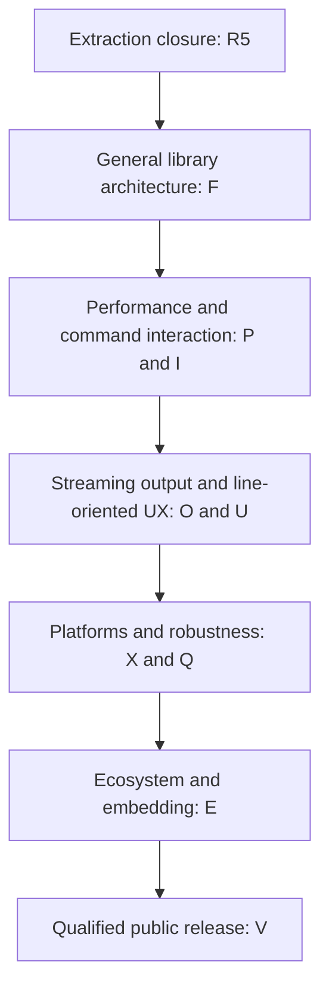

# Project status

This is the sole authority for current project status and future direction.
Implemented contracts live in [the documentation map](docs/README.md);
[CHANGELOG](CHANGELOG.md) and Git retain completed changes. Planned series below
are engineering objectives, not existing features, API declarations, release
promises or authorization to begin the next wave.

## Thesis: simple entry, room to grow

REPLAI is becoming an **embeddable interactive command-line substrate**:
editing, terminal lifecycle, input decoding, history mechanics, host analysis,
rendering and output coordination beneath an application-owned command loop.
It should be immediately useful to a small CLI, then support richer application
shells, database/debugger/compiler frontends and long-lived processes with
background or streaming output without replacing the interaction engine.
Streaming model clients and agents are important consumers of these generic
properties; their commands, execution, state and semantics remain outside the
library. REPLAI remains narrower than a shell framework or a full-screen TUI.

Small embedding cost and simple mental models matter as much as richer behavior.
The conceptual reference is modern linenoise, including its multiplexed editing
and hide/show output lifecycle, not only its original blocking line-read call.
[Linenoise's current documentation](https://github.com/antirez/linenoise/blob/master/README.markdown)
also describes multiline editing, hints, bracketed paste, UTF-8 and masking.
These are comparative design inputs, not borrowed compatibility guarantees.

[Reedline](https://github.com/nushell/reedline) demonstrates separate completion,
hints, validation, edit modes and menus, with an explicitly experimental
concurrent external printer. [Rustyline's helper boundary](https://docs.rs/crate/rustyline/18.0.1/source/src/lib.rs)
combines analysis roles and explicitly raises parsing a draft once for their
shared use. REPLAI should preserve the simplicity of embedding while making
that richer analysis and output coordination coherent. It must measure its own
tradeoffs rather than infer superiority from a feature list.

## Extraction foundation and current status

| Wave | Status and established property |
| --- | --- |
| R0 — Repository genesis | Completed: independent repository, safe Rust foundation and application-neutral ownership |
| R1 — Terminal editor kernel | Completed: Linux grapheme editor, bounded decoder/paste, history, lifecycle and terminal-native presentation |
| R2 — Interaction API / ABI | Completed: movable native ownership, C ABI 1, installed static/shared consumers, real PTY/layout/resource/memory qualification |
| R3 — First consumer | Completed: YVEX consumes the qualified C boundary; product execution and cancellation remain host-owned |
| R4 — Second consumer | Completed: YAI consumes native Rust; transient edits remain distinct from canonical conversation submission |
| R5 — LEGACY.OWNERSHIP.CLOSURE | Consumer editor removal and local qualification established; outstanding YVEX publication reconciliation is externally owned |

The extraction-era consumer qualification used exact revision
`df5538c718b8d068432032e7fb116fb8bfab158e`. Current consumer pins/publication
are externally owned; library documentation evolution does not justify repinning. The remaining consumer publication reconciliation does not block independent
library architecture work unless it demonstrates a reproducible generic contract
defect. This repository does not declare that external publication complete.

**F0 — PUBLIC.ARCHITECTURE is completed.** One platform-neutral engine now
drives deterministic tests and the preserved Linux Rust/C interaction path.
At F0, native macOS/Windows CI established engine and virtual-transport execution.
See [F0 evidence](docs/engineering/f0.md) for that original boundary.
**P0 — PERFORMANCE.BASELINE is completed.** Versioned component/allocation,
real Linux PTY, idle/output, embedding and pinned comparative measurements are
recorded in [P0 evidence](docs/engineering/p0.md), with explicit environment,
variance and unsupported-workload limits. No performance optimization was made.
**MACOS.RUNTIME.PERFORMANCE.CLOSURE.0 is completed**, closing X1/P1/P2 together.
One shared POSIX implementation qualifies real Linux/macOS terminals, including
ABI 1. Native before/after evidence, retained causal checkpoints and final
qualification are recorded in the [combined dossier](docs/engineering/macos-perf.md).
The final primary burst median is 0.194 ms against a same-run parity limit of
0.575 ms, with preserved isolated-key latency and substantially fewer layout
allocations. This is a workload-specific result, not a general performance claim.
Internal input batching does not close public P3 host driving.
**STRUCTURED.PRESENTATION.0 is active**, implementing O0/U0 together: bounded
semantic output blocks and composed prompts share safe spans, roles and layout.
Closure requires the existing Linux/macOS Rust/C qualification plus structured
PTYs, Windows portable tests and benchmark integrity. F1/F2, I series, O1/O2/O3,
U1/U2/U3, public P3 embedding and Windows runtime remain unstarted. No next wave
or consumer repin is authorized.

System-terminal runtime qualification covers Linux and macOS,
and remains pre-release. There is no stable API,
ABI, SemVer or MSRV promise. The current implementation has one active terminal
interaction per linked library image, synchronous safe-text output transactions
and host-owned signal meaning. It does not support independent concurrent
writers. See [interaction](docs/interaction.md) and
[presentation](docs/presentation.md) for the actual conditions.

## Ordered development map

This is dependency order, not a promise to finish a whole series before learning
from another. In particular, the first post-R5 design must consider **API tiers,
performance baselines and event-loop architecture together**. F0 frames that
joint investigation; F1, P0 and P3 retain distinct deliverables. A convenient API
cannot be frozen before understanding its blocking behavior and costs. F0 and P0 have explicit task authorization; later implementation is not authorized
by the roadmap or by external consumer closure. The explicit combined macOS
and performance closure authorization above supersedes that original ordering.

### Foundation — one engine, several embedding levels

| Wave | Property to establish |
| --- | --- |
| F0 — PUBLIC.ARCHITECTURE | **Completed.** Platform-neutral interaction/actions/layout/render, separate VT protocol and POSIX resources, native macOS/Windows engine execution and preserved Linux Rust/C qualification |
| F1 — API.TIERS | A small blocking/read-line entry, an explicit host-driven interaction surface, and a driven/multiplexable surface over the same engine; simple programs need no elaborate event loop |
| F2 — TERMINAL.CAPABILITIES | Explicit capabilities and degradation policy, rather than scattered environment checks; request only features needed by the selected line-oriented interaction |

These are responsibilities to test, not a prescribed module tree or object
layout. The lowest integration tier must accept host readiness, resize and
arriving analysis/output without imposing Tokio, another async runtime or a
threading model. The higher tiers must not become separate editors.
Capabilities should distinguish styling, paste, cursor operations and width
assumptions. TERM=dumb needs a deliberate degradation contract; a capability
inventory does not authorize mouse interfaces, alternate screens or a canvas.

### Performance — measure before replacing the kernel

| Wave | Property to establish |
| --- | --- |
| P0 — PERFORMANCE.BASELINE | **Completed.** Reproducible component and Linux PTY latency, allocations, memory, bytes, writes/syscalls, idle and embedding baselines; pinned linenoise/rustyline/reedline overlaps and limitations in [P0 evidence](docs/engineering/p0.md) |
| P1 — EDITOR.KERNEL.PERFORMANCE | **Completed in MACOS/PERF.** Measured local Unicode boundary validation retains String storage; generated Unicode oracles and native scaling evidence qualify the choice |
| P2 — INCREMENTAL.RENDER | **Completed in MACOS/PERF.** Viewport storage, geometry reuse, changed-row rendering and ready-input presentation scheduling meet same-machine parity with preserved correctness and terminal efficiency |
| P3 — EVENT.DRIVER | **Unstarted.** Host event-loop embedding without artificial periodic polling where readiness/resize mechanisms permit it; internal bounded reads do not deliver this public driver contract |

The editor uses String storage and context-local grapheme boundary work. Layout
retains the viewport and reuses stable geometry; rendering updates changed rows
or suffixes where valid. Full prefix scans and redraw fallbacks remain measured
costs. Polling still checks dimensions and caps waits at 100 ms without owning
resize signals. P0 remains the immutable characterization baseline; the combined
dossier records the authorized redesign and its remaining limits.

P0 must characterize beginning/middle/end edits; ASCII, CJK, combining and emoji
movement; key-to-frame p50/p95/p99; output chunk rates; lifecycle and FD stability;
and substantial pasted SQL, source, JSON or prose. Proposed pressure ranges
include 1 KB–1 MB paste, 100–100k history entries and 10–100k candidates where the
respective interface exists. Unsupported ranges must be labelled, never counted
as current capacity. Compare equivalent behaviors and record platform, terminal,
versions and bounds. Local opt-in counters for frames, redraws, writes, stale
analysis and layout work should explain costs with negligible disabled overhead;
this is development instrumentation, not telemetry. Gap buffers, ropes or piece
tables are possible outcomes, not predetermined upgrades.

### Command interaction — host knowledge, library mechanics

| Wave | Property to establish |
| --- | --- |
| I0 — ANALYSIS.PROTOCOL | Revision-aware shared analysis of draft/cursor/context, so one host parse can drive multiple features and stale results cannot mutate a newer draft |
| I1 — COMPLETION | Host-defined replacement ranges, display/descriptive metadata and acceptance policy; rich candidates independent of a particular menu |
| I2 — HINT.HIGHLIGHT | Generic hints/autosuggestions and styled spans derived from host analysis |
| I3 — VALIDATION.MULTILINE | Host-defined complete/incomplete/invalid outcomes govern submission, continued editing and diagnostics without embedding a language parser |
| I4 — HISTORY.SEARCH | Navigation separated from storage; bounded memory adapters, custom/persistent providers and incremental/prefix/reverse search with host privacy/retention policy |
| I5 — KEYMAP.EDITING | Key sequences map to generic edit commands independently of the decoder: word operations, undo/redo, search and eventual Emacs/Vi/custom bindings |
| I6 — SECRET.INPUT | Explicit masked/hidden behavior with history denied by default and a clear sensitive-input lifecycle |

Analysis results must identify the revision they describe. Completion, hints,
highlighting and validation should reuse the same derived snapshot; slow host
lookups must not overwrite intervening edits. Context fields, candidate tags,
selection and semantic word-boundary shapes remain design questions. REPLAI
never acquires the host parser, command registry, filesystem lookup or history
storage policy merely because it can present their results.

### Output and presentation — long-running terminal-native interaction

| Wave | Property to establish |
| --- | --- |
| O0 — OUTPUT.MODEL | **Active in STRUCTURED.PRESENTATION.0.** Bounded semantic documents/spans, responsive blocks and safe standalone/coordinated output; no trusted raw path |
| O1 — STREAMING.OUTPUT | Characterize and optimize sustained chunks from any host, including build logs, debugger events and model text |
| O2 — MULTIPLEXED.INTERACTION | Background/streaming output coexists with an editable draft, preserving cursor, draft and terminal ownership under explicit arbitration |
| O3 — TRANSIENT.FEEDBACK | Generic notices/diagnostics and transient feedback without owning product rendering |
| U0 — PROMPT.LAYOUT | **Active in STRUCTURED.PRESENTATION.0.** Composed primary/continuation spans with shared theme and cell geometry; optional right-side information remains deferred |
| U1 — COMPLETION.UX | Inline, list, cycling and menu strategies over the completion contract |
| U2 — MULTILINE.UX | Substantial multiline continuation, wrapping, cursor geometry and diagnostic presentation |
| U3 — VISUAL.SYSTEM | Coherent semantic roles, themes, spacing, accessibility and terminal-native background behavior |

Exclusive execution remains useful: submit, release editing, emit host output,
then reopen. Concurrent editing is a separate, harder contract. Output arbitration
must coordinate the editing surface, notices and completion presentation without
interpreting the stream's product meaning. Long output and a host emitting
5–200 chunks per second are workloads to characterize, not token semantics or
performance promises. No full-screen dashboard or hidden theme replacement is
implied by a richer line surface.

### Platforms, robustness and a qualified ecosystem

| Wave | Property to establish |
| --- | --- |
| X0 — BACKEND.SEPARATION | Platform-independent editor/render/interaction logic separated from OS terminal resources and protocols |
| X1 — MACOS.QUALIFICATION | **Completed in MACOS/PERF.** Shared POSIX Rust/C ABI 1 runtime qualified on physical macOS PTYs and real-terminal CI |
| X2 — WINDOWS.CONPTY.INVESTIGATION | Independent backend feasibility and qualification, without premature compatibility branches in the Unix implementation |
| Q0 — FUZZ.PROPERTY | Decoder/state-machine fuzzing and arbitrary edit-sequence invariants |
| Q1 — RESOURCE.FAILURE.STRESS | Repeated lifecycle, resize/paste/output storms, descriptor exhaustion and controlled I/O/allocation failures where simulatable |
| Q2 — PERFORMANCE.REGRESSION | Stable, meaningful performance properties become guarded regressions after baseline variance is understood |
| E0 — PACKAGING | Reproducible Cargo, C ABI installation, pkg-config, CMake and static/shared external builds |
| E1 — CONSUMER.MATRIX | Small genuinely distinct Rust/C/C++ command, SQL-like, debugger and streaming consumers over the same implementation |
| E2 — INTEGRATION.COOKBOOK | Copyable patterns derived from those executed consumers, rather than speculative wrappers |
| E3 — API.FREEZE.CANDIDATE | Audit ownership, ergonomics, failure/lifetime behavior and cross-language compatibility before any promise |
| V0 — RELEASE.QUALIFICATION | Exact platform, API, ABI, packaging and support claims backed by reproducible evidence |
| V1 — PUBLIC.0.1 | Consider publication and the first compatibility commitment only after release qualification |

Robustness work should accompany changing boundaries even though its complete
qualification series follows them. BSD and further language wrappers are future
investigations, not implied support. The C ABI supplies a language-neutral
embedding route; it does not require publishing wrappers for every language.
Release is the conclusion of qualified ownership and real integration, not a
calendar milestone or a version number already present in Cargo metadata.
