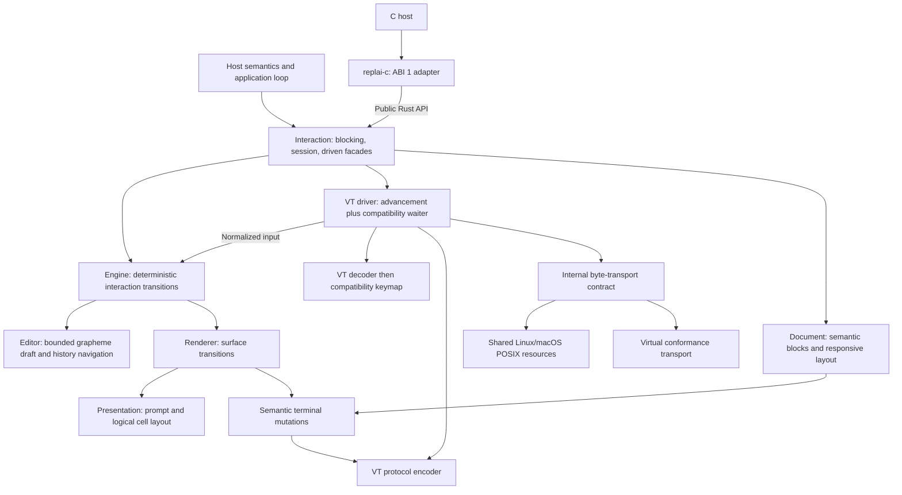
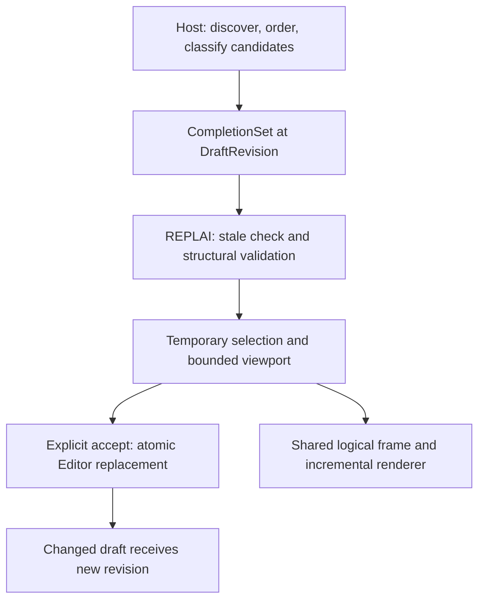
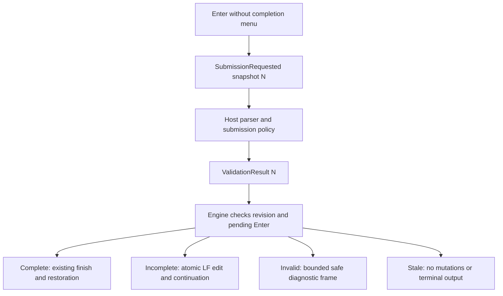

# Architecture and ownership

REPLAI is an embeddable interactive command-line substrate. The host owns its
language, commands, execution and durable state. One safe Rust engine owns
transient editing and interaction, independent of the operating system, terminal
protocol and host scheduler. Native Rust and the C adapter use that same engine.
[Project status](../ROADMAP.md) owns wave status; [the REPL guide](repl.md)
explains where terminal interaction sits in the classical interpreter cycle.

## Ownership and structure

These arrows describe ownership/calls, not threads. The engine neither acquires
resources nor waits for input. The driver supplies normalized input and executes
returned effects. A byte transport is one system realization, not a definition
of all possible terminal input. Structured console key/text events can map to
normalized input without synthesizing VT bytes. A non-VT output executor can
consume semantic mutations without parsing an escape-coded frame.

| Source owner | Implemented responsibility | Excluded responsibility |
| --- | --- | --- |
| [core](../src/core.rs) | Bounded UTF-8 storage, grapheme cursor, atomic edits, history navigation and original-draft restoration | OS resources, environment, scheduling, history admission policy or persistence |
| [actions](../src/actions.rs) | Text, editing commands, interaction requests, resize, transport EOF and rejection vocabulary | Key bytes, descriptors, OS event structures |
| [input](../src/input.rs) | Incremental bounded VT/UTF-8 recognition and atomic paste framing | Editor operations and keymap policy |
| [keymap](../src/keymap.rs) | Current fixed compatibility mapping from recognized keys to actions | Editor storage; future configurable/Vi/Emacs modes |
| [engine](../src/engine.rs) | Active surface, editor, submit/interrupt/EOF, completion application, render invalidation and safe output coordination | FDs, HANDLEs, clocks, threads, protocols or environment |
| [document](../src/document.rs) | Safe spans/blocks, bounded responsive document layout and independent writer output | Host schema, product meaning, editor state or terminal acquisition |
| [presentation](../src/presentation.rs) | Prompt, semantic roles, logical text/style runs, grapheme/cell layout and viewport | Resource acquisition or escape-coded layout |
| [render](../src/render.rs) | Private cached frame, incremental transition and logical mutations | OS APIs or terminal escape serialization |
| [protocol](../src/protocol.rs) | VT encoding of text, style, moves, clear, newline and paste-mode operations | Geometry, editing policy or resource ownership |
| [capabilities](../src/capabilities.rs) | Protocol assumptions, native facts, requirements, degradation and inspectable snapshots | Active probing, OS handles or application policy |
| [width](../src/width.rs) | Shared deterministic UnicodeNarrow cell policy | Font/emulator discovery or editor storage |
| [substrate](../src/substrate.rs) | Internal byte transport, dimensions, readiness wait, write and restoration contract | Interaction meaning or universal public terminal interface |
| [terminal](../src/terminal.rs) | Generic VT driver over a statically selected transport; timing, decoder expiry, effect execution and cleanup | termios, descriptors or duplicate editing logic |
| [system](../src/system.rs) | Shared Linux/macOS POSIX acquisition, descriptor duplication, termios, dimensions, poll/read/write, backend lease | Decoder, prompt, events, palette or editor |
| [interaction](../src/interaction.rs), [event](../src/event.rs) | Three native facades and portable outcomes/errors | Product loop, language or command authority |

**Generic terminal presentation belongs to the library; semantic classification
and content belong to the host.** The host still owns completion discovery/order/meaning,
history admission/privacy, labels, execution, cancellation meaning and output
content. There is no application registry, parser, filesystem completion or
network dependency inside the engine.

## Composition and public boundaries

`Interaction` owns an `Engine`, which owns its `Editor` and optional active
surface. On Linux/macOS the façade separately owns an optional `Terminal<Resource>`.
The driver borrows the engine only for each operation. No stored self-reference,
forged lifetime, pointer registry or pinned owner is necessary.

`Document`, `Block`, `Text`, `Span`, table/list/severity metadata, `Style`,
`Foreground`, `Editor`, `EditError`, `Prompt`, `Theme`, `Role`, `Interaction`, `Event` and `Error`
are exported on every compilation target. Construction and closed editor access
are portable. The existing `open`, `poll`, `complete`, `external_output`,
`output_document`, `open_with_theme`, `interrupt` and `close` system façade is available on Linux and macOS. No fake acquisition
method returning Unsupported is supplied on another OS. The deterministic
engine/action/effect APIs remain private. Portable `WaitInterest`, `Wake`,
`Deadline`, `ReadOutcome` and terminal fact/policy types expose scheduling and
admission without exposing frames or decoder state. `Error::CapabilityMismatch`
is the additional native variant; exhaustive Rust matches must accommodate it.
Existing session behavior and C ABI 1 remain preserved.

The old terminal object owned editor transitions and rendering alongside OS
resources. The façade now delegates policy to the same engine exercised without
a terminal in [conformance tests](../src/conformance.rs). Internal input and
mutation types are not exported through Rust or C. A future blocking loop,
session loop and host-driven façade can all wrap `Engine::start/apply/complete`
and its effects. F0 implements none of those future public interfaces.

`Theme::new`, `from_environment` and `sequence` remain compatibility methods.
Environment discovery delegates to capabilities; the legacy sequence method
delegates to the VT palette. Layout consumes roles, never these sequences.
This small public compatibility exception does not make VT the render model.

## Draft analysis ownership

The `Editor` owns the only `DraftRevision` because it owns every text/cursor
mutation, including closed and standalone editing. The engine ends that same
revision on semantic submit/interrupt/EOF; resource close/reopen does not create
a second counter. `analysis.rs` contains only opaque identity, shared immutable
snapshot storage and typed application outcome. It has no terminal dependency.

A snapshot leaves the host-owned interaction without borrowing its mutable draft.
One host parse may feed multiple derivations; REPLAI owns neither their payloads
nor execution. `complete_at` uses the same completion/editor/render path after an
exclusive revision check. A stale result produces no mutations. This adds no
scheduler, lock, parser, feature-specific result envelope or analysis cache.
[Interaction semantics](interaction.md#revision-aware-host-analysis) define domain,
lifecycle, failure and memory ownership; the [I0 dossier](engineering/analysis-protocol.md)
records executable evidence. Future I1/I2/I3 reuse this provenance boundary.

## Input and outcome boundaries

VT decoding produces recognized keys or a complete paste payload. The fixed
keymap maps those to `Input::Text`, `EditCommand` or `Request`. Engine transitions
call the editor. Another keymap or a structured OS event source need only target
those actions; editor storage and VT recognition do not need to change.

Transport EOF is distinct from the DeleteOrEof request. The former ends input
even with a nonempty draft; the latter deletes the next grapheme unless the
buffer is empty. Completion requests produce a host event, and replacement
validates current grapheme boundaries and capacity before mutation. Interrupt
has no application cancellation meaning. Readiness and transport errors belong
to the driver, not to editor state. The driver closes the engine on a fatal
protocol or I/O failure and attempts cleanup before returning a public error.

Paste remains an atomic text insertion: CR/LF normalization, UTF-8 validation,
bounded staging and rejection occur before editor mutation. Controls inside
paste never become shortcuts. Pending-byte expiry is explicit to the decoder;
the current VT driver supplies the 250 ms idle rule using its clock.

## Presentation, rendering and safe output

Layout computes logical text/style runs and cell coordinates; its private frame
contains no ANSI strings. Extended-grapheme editing is separate from cell-width
policy. Public `WidthPolicy::UnicodeNarrow` names the deterministic non-CJK
cell estimate shared by document and editing layout. Terminal/font disagreement
remains possible; this contract does not claim discovery or pixel agreement.

The renderer transforms previous/current logical frames into a small private
mutation vocabulary. It reuses stable cursor geometry and simple ASCII tail
edits, updates changed rows, and retains full erase/redraw for changed geometry.
ASCII row prefixes may be retained; Unicode changes keep the shared width policy
and use row replacement where needed. Full layout retains only the potential
viewport and recycles row storage while locating the cursor. It can stop after
the visible suffix; a distant cursor still requires scanning its prefix.
Only the VT encoder turns moves, clears, style and protocol modes
into byte sequences. The default background, continuation rhythm, viewport and
cursor contracts remain in [presentation](presentation.md). Engine invalidation
and ready-input presentation scheduling are common code on every platform;
neither the renderer nor editor has a Linux/macOS branch.

External output validation and editing-surface coordination are engine work:
reject controls, suspend the visible surface, emit semantic text/style/newline
operations, then restore the draft and cursor. The driver serializes those
operations. LF/CRLF normalization and TAB admission are unchanged. CSI, OSC,
DCS and clipboard/title operations cannot enter through safe host text. There is
no trusted raw-output API, asynchronous writer or output scheduler.

Structured documents add bounded output layout alongside editing layout, using
shared logical text/style runs, Unicode width policy and terminal mutations.
They do not enter the editor's per-key path. Standalone rendering and active
output share document layout; active output then uses the existing engine
surface transaction. Prompt segments reuse the safe inline representation.
The [presentation contract](presentation.md) owns block geometry, bounds and
failure atomicity. No JSON framework or new dependency is required. Old plain
output retains its unwrapped byte semantics through the same coordinator.
The C binding continues to expose only its qualified plain presentation surface;
structured C output needs a separate future design, not additions to ABI 1.

## System and protocol realizations

The internal `Transport` trait is deliberately byte-oriented for the existing
VT driver. It is statically dispatched, has no OS handle in its signatures, and
is also implemented by an in-memory test device. Acquisition stays outside the
trait: each backend must validate and capture its actual resources before
constructing a driver. `restore` must be retryable and restore the captured
state, while cleanup writes may use a backend-specific alternate route.

The POSIX realization is shared by Linux and macOS. `rustix` supplies safe
termios capture/restore, FD duplication, same-TTY identity, dimensions and I/O.
Only readiness differs: Linux uses rustix poll; Darwin uses an owned kqueue via
nix's safe event wrapper. Darwin's `/dev/tty` alias rejects kqueue and uses safe
select with an explicit FD_SETSIZE check instead. The kqueue has one read
registration installed after raw mode, no signal hooks, executor or background
thread. Lease and lifecycle semantics remain common. The 100 ms compatibility
wait cap still observes resize; this is not the future public P3 event API.

Multiple deterministic engines and virtual terminals can run concurrently;
multiple real POSIX interactions remain refused for compatibility. Windows
Console modes, HANDLE ownership and ConPTY remain future resource boundaries.
No Windows runtime is implemented.

## C compatibility and safety

The separate binding consumes only public Rust API. ABI 1's `replai_open` takes
integer POSIX-style descriptors: it is the existing POSIX compatibility
surface, not a portable Windows acquisition contract. Header records, symbols,
numeric values, caller serialization, pointer/length text and caller-owned copy
buffers are unchanged. Future portable C acquisition needs separate design; F0
does not choose an endpoint object, HANDLE entry point, callback I/O or new ABI.
See [C API](c-api.md) and its generated schema/layout authority.

The implementation crate still forbids unsafe code and requires documented
public items. Only the unchanged C binding contains narrowly justified pointer,
span and borrowed-descriptor unsafety. No third-party type enters the public
Rust API. There is one implementation behind both languages.

## Portability, qualification and deferred cost decisions

Architecture portability, compilation, deterministic execution and real terminal
qualification are distinct claims. The CI portable-engine matrix runs library,
editor, decoder, layout, engine and virtual-driver tests natively on Linux,
macOS and Windows. Linux and macOS additionally run real PTYs and native
C/resource/memory gates. Windows remains a portable-core target. The combined
[macOS/performance dossier](engineering/macos-perf.md) records native checkpoint
and convergence evidence; ROADMAP owns current qualification status.

The [F0 engineering evidence](engineering/f0.md) records identities, comparative
source archaeology, actual results and limitations. [Architecture guards](../tests/architecture.rs)
check dependency direction; deterministic conformance tests and real PTYs prove
behavior instead of relying on source searches alone.

Private `String`/`VecDeque` storage, grapheme traversal, logical-run vectors,
effect allocations, frame rebuilds and VT serialization remain measurable
implementation choices. F0 is not a performance improvement claim. Decoder,
action mapping, editor transition, layout, frame transition, encoding and
transport have separate call boundaries. P0 can measure them independently;
P1/P2 may replace representations without exporting them to consumers.

## Dependencies

[Cargo.toml](../Cargo.toml) and [Cargo.lock](../Cargo.lock) own dependency requests
and exact repository resolution. F0 added no dependency; macOS readiness adds
only target-specific nix readiness support, reviewed in the closure dossier.

| Dependency | Correctness responsibility | License selection | Scope |
| --- | --- | --- | --- |
| `rustix` | Safe termios, FD identity, readiness and transport; PTYs in tests | MIT option | Linux/macOS targets |
| `nix` | Safe Darwin kqueue ownership and select fallback | MIT | macOS event/poll features only |
| `unicode-segmentation` | Extended-grapheme boundaries | MIT option | Editor and layout |
| `unicode-width` | Current cell-width estimate | MIT option | Logical layout |
| `vt100` | Independent VT cell/style/cursor oracle | MIT | Tests only |
| `libc` | Fallible descriptor validation before borrowing | MIT option | Existing C binding only |

No sibling checkout, async runtime, system framework or new package is required.
The separate Mermaid/DOM tooling remains documentation-only.

## Scheduling convergence

`Interaction::read_line` composes the compatibility waiter over the same bounded
input advancement used by `advance`. `poll` refreshes geometry and selects a
bounded wait; `advance(InputReady)` selects zero wait, `advance(Resize)` refreshes
geometry, and `advance(Deadline)` validates the opaque session/input token before
reconciling queued input and expiry. None implements editing or rendering again.

The private terminal driver owns monotonic deadline identity. The deterministic
engine still owns only semantic transitions. A borrowed POSIX input source lets
the host register its own reactor; no FD appears in portable wake types. A future
Windows resource facade can expose its own borrowed native wait source without
forking the engine. The transport waiter remains replaceable beneath this
contract; Linux/macOS share advancement and differ only in native waiting.

The [embedding contract](interaction.md#embedding-tiers-and-wait-ownership) owns
ordering, read-ahead, admission and cleanup guarantees. The
[bounded qualification dossier](engineering/embedding.md) records alternatives,
measurements and the executed platform scope. Public driven scheduling does not
expose a raw-byte transport API or introduce concurrent output ownership.

## Capability and acquisition boundary

One [resolver](../src/capabilities.rs) serves blocking, session and driven opens.
`TerminalFacts` describes protocol evidence/assumptions; `TerminalRealization`
describes resource observations; `InteractionRequirements` selects required
mechanics; `FeaturePolicy` governs optional losses. `TerminalCapabilities` records
all four plus effective features, degradations, width policy and resize paths.

The POSIX owner verifies paired TTYs, captures termios and reads dimensions,
then resolves admission **before raw mode**. Native resource observations cannot
be overridden by protocol configuration. The driver stores the admitted snapshot
and uses its theme/features without per-key/per-frame resolution. Refresh changes
only last-observed dimensions; protocol deadlines remain separate driver state.
Legacy session/C opens use an explicit compatibility profile through the same
resolver. Their VT assumptions remain `Assumed`, even under TERM=dumb.
[Precedence and admission](interaction.md#terminal-capabilities) ·
[Qualification](engineering/terminal-capabilities.md).

## Candidate delivery and temporary selection

[completion.rs](../src/completion.rs) owns bounded safe data and portable menu
geometry. Engine owns the active selection inside its interaction surface,
separately from Editor. Selection is allocated only when nonempty candidates are
installed. Keymap translates physical Tab/Shift-Tab/Escape into generic requests;
Engine dispatches them according to whether candidates are active. Resources
and protocol serialization do not implement completion policy.

The existing frame transition consumes the combined draft/menu frame. No second
renderer, editor or deadline system exists. Draft changes invalidate selection;
terminal-only changes do not. The [contract](interaction.md#revision-bound-completion-candidates)
and [dossier](engineering/completion-contract.md) define ordering, bounds and
qualification. Native Rust exposes this addition; C ABI 1 stays unchanged.

## Host validation over the revision boundary

Editor owns identity and logical vertical navigation. Optional Engine state owns
pending Enter authority and one current diagnostic presentation. Terminal still
owns the same protocol/resource lifecycle. Neither renderer nor backend knows the
host grammar. Complete returns its event through serialized result delivery;
there is no second event queue or validation scheduler. The
[interaction contract](interaction.md#validated-submission-and-multiline-navigation)
and [I3/U2 evidence](engineering/validation-multiline.md) define the exact boundaries.
