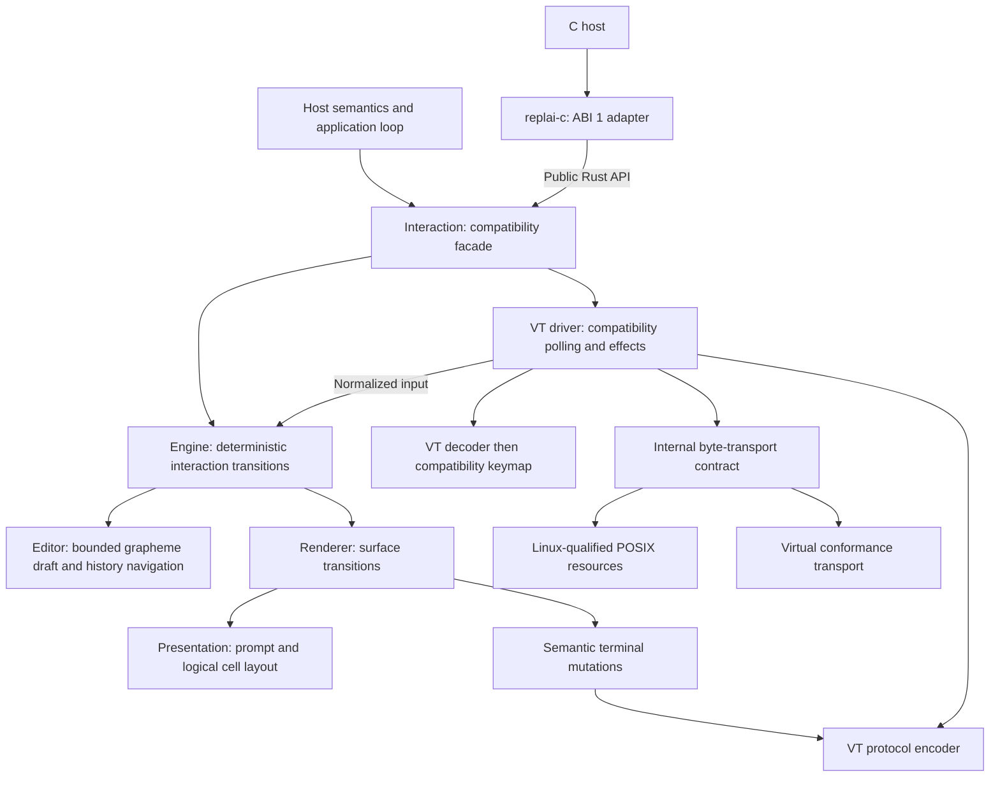

# Architecture and ownership

REPLAI is an embeddable interactive command-line substrate. The host owns its
language, commands, execution and durable state. One safe Rust engine owns
transient editing and interaction, independent of the operating system, terminal
protocol and host scheduler. Native Rust and the C adapter use that same engine.
[Project status](../ROADMAP.md) owns wave status; [the REPL guide](repl.md)
explains where terminal interaction sits in the classical interpreter cycle.

## Ownership and structure

These arrows describe ownership/calls, not threads. The engine neither acquires
resources nor waits for input. The driver supplies normalized input and executes
returned effects. A byte transport is one system realization, not a definition
of all possible terminal input. Structured console key/text events can map to
normalized input without synthesizing VT bytes. A non-VT output executor can
consume semantic mutations without parsing an escape-coded frame.

| Source owner | Implemented responsibility | Excluded responsibility |
| --- | --- | --- |
| [core](../src/core.rs) | Bounded UTF-8 storage, grapheme cursor, atomic edits, history navigation and original-draft restoration | OS resources, environment, scheduling, history admission policy or persistence |
| [actions](../src/actions.rs) | Text, editing commands, interaction requests, resize, transport EOF and rejection vocabulary | Key bytes, descriptors, OS event structures |
| [input](../src/input.rs) | Incremental bounded VT/UTF-8 recognition and atomic paste framing | Editor operations and keymap policy |
| [keymap](../src/keymap.rs) | Current fixed compatibility mapping from recognized keys to actions | Editor storage; future configurable/Vi/Emacs modes |
| [engine](../src/engine.rs) | Active surface, editor, submit/interrupt/EOF, completion application, render invalidation and safe output coordination | FDs, HANDLEs, clocks, threads, protocols or environment |
| [presentation](../src/presentation.rs) | Prompt, semantic roles, logical text/style runs, grapheme/cell layout and viewport | Resource acquisition or escape-coded layout |
| [render](../src/render.rs) | Private previous frame, append/full-redraw transition and logical mutations | OS APIs or terminal escape serialization |
| [protocol](../src/protocol.rs) | VT encoding of text, style, moves, clear, newline and paste-mode operations | Geometry, editing policy or resource ownership |
| [capabilities](../src/capabilities.rs) | Existing explicit color/environment policy resolution | Full F2 capability negotiation or Windows discovery |
| [substrate](../src/substrate.rs) | Internal byte transport, dimensions, readiness wait, write and restoration contract | Interaction meaning or universal public terminal interface |
| [terminal](../src/terminal.rs) | Generic VT driver over a statically selected transport; timing, decoder expiry, effect execution and cleanup | termios, descriptors or duplicate editing logic |
| [system](../src/system.rs) | Linux-qualified POSIX acquisition, descriptor duplication, termios, dimensions, poll/read/write, backend lease | Decoder, prompt, events, palette or editor |
| [interaction](../src/interaction.rs), [event](../src/event.rs) | Public compatibility façade and portable outcomes/errors | Product loop, language or command authority |

**Generic terminal presentation belongs to the library; semantic rendering
belongs to the host.** The host still owns completion discovery/selection,
history admission/privacy, labels, execution, cancellation meaning and output
content. There is no application registry, parser, filesystem completion or
network dependency inside the engine.

## Composition and public boundaries

`Interaction` owns an `Engine`, which owns its `Editor` and optional active
surface. On Linux the façade separately owns an optional `Terminal<Resource>`.
The driver borrows the engine only for each operation. No stored self-reference,
forged lifetime, pointer registry or pinned owner is necessary.

`Editor`, `EditError`, `Prompt`, `Theme`, `Role`, `Interaction`, `Event` and `Error`
are exported on every compilation target. Construction and closed editor access
are portable. The existing `open`, `poll`, `complete`, `external_output`,
`interrupt` and `close` system façade remains Linux-gated. No fake acquisition
method returning Unsupported is supplied on another OS. The deterministic
engine/action/effect APIs are private until F1/P3 establish a public contract.
Linux signatures, result variants and host-visible semantics are preserved.

The old terminal object owned editor transitions and rendering alongside OS
resources. The façade now delegates policy to the same engine exercised without
a terminal in [conformance tests](../src/conformance.rs). Internal input and
mutation types are not exported through Rust or C. A future blocking loop,
session loop and host-driven façade can all wrap `Engine::start/apply/complete`
and its effects. F0 implements none of those future public interfaces.

`Theme::new`, `from_environment` and `sequence` remain compatibility methods.
Environment discovery delegates to capabilities; the legacy sequence method
delegates to the VT palette. Layout consumes roles, never these sequences.
This small public compatibility exception does not make VT the render model.

## Input and outcome boundaries

VT decoding produces recognized keys or a complete paste payload. The fixed
keymap maps those to `Input::Text`, `EditCommand` or `Request`. Engine transitions
call the editor. Another keymap or a structured OS event source need only target
those actions; editor storage and VT recognition do not need to change.

Transport EOF is distinct from the DeleteOrEof request. The former ends input
even with a nonempty draft; the latter deletes the next grapheme unless the
buffer is empty. Completion requests produce a host event, and replacement
validates current grapheme boundaries and capacity before mutation. Interrupt
has no application cancellation meaning. Readiness and transport errors belong
to the driver, not to editor state. The driver closes the engine on a fatal
protocol or I/O failure and attempts cleanup before returning a public error.

Paste remains an atomic text insertion: CR/LF normalization, UTF-8 validation,
bounded staging and rejection occur before editor mutation. Controls inside
paste never become shortcuts. Pending-byte expiry is explicit to the decoder;
the current VT driver supplies the 250 ms idle rule using its clock.

## Presentation, rendering and safe output

Layout computes logical text/style runs and cell coordinates; its private frame
contains no ANSI strings. Extended-grapheme editing is separate from cell-width
estimation. `unicode-width` remains the current internal estimate, not a public
width promise. Terminal/font disagreement, particularly joined emoji, remains
possible; no probing or new width policy is implemented.

The renderer transforms previous/current logical frames into a small private
mutation vocabulary. It retains the existing append optimization and otherwise
erases/redraws. Only the VT encoder turns moves, clears, style and protocol modes
into byte sequences. The default background, continuation rhythm, viewport and
cursor contracts remain in [presentation](presentation.md). P2 can replace the
transition algorithm without changing engine actions or resource acquisition.

External output validation and editing-surface coordination are engine work:
reject controls, suspend the visible surface, emit semantic text/style/newline
operations, then restore the draft and cursor. The driver serializes those
operations. LF/CRLF normalization and TAB admission are unchanged. CSI, OSC,
DCS and clipboard/title operations cannot enter through safe host text. There is
no trusted raw-output API, asynchronous writer or output scheduler.

## System and protocol realizations

The internal `Transport` trait is deliberately byte-oriented for the existing
VT driver. It is statically dispatched, has no OS handle in its signatures, and
is also implemented by an in-memory test device. Acquisition stays outside the
trait: each backend must validate and capture its actual resources before
constructing a driver. `restore` must be retryable and restore the captured
state, while cleanup writes may use a backend-specific alternate route.

The POSIX realization currently compiles only on Linux. `rustix` is a Linux
**target-specific** dependency. Its single-active-terminal lease, exact termios
capture/restore, FD duplication and same-TTY checks live in `system`, not in the
engine. Multiple deterministic engines and virtual terminals work concurrently;
multiple real Linux terminals remain refused for compatibility. No signal
handlers or threads are installed. The 100 ms poll cap and repeated dimension
query belong to the compatibility driver and can be replaced by a later driver.

macOS/BSD can add or qualify a POSIX resource realization without changing the
engine. Windows Console modes, HANDLE ownership and waits belong to a Windows
resource realization. ConPTY/VT transports can reuse the byte driver/encoder;
structured Console input or non-VT output can instead use normalized actions
and logical mutations. These are extension paths, not existing OS backends.

## C compatibility and safety

The separate binding consumes only public Rust API. ABI 1's `replai_open` takes
integer POSIX-style descriptors: it is the existing Linux-qualified compatibility
surface, not a portable Windows acquisition contract. Header records, symbols,
numeric values, caller serialization, pointer/length text and caller-owned copy
buffers are unchanged. Future portable C acquisition needs separate design; F0
does not choose an endpoint object, HANDLE entry point, callback I/O or new ABI.
See [C API](c-api.md) and its generated schema/layout authority.

The implementation crate still forbids unsafe code and requires documented
public items. Only the unchanged C binding contains narrowly justified pointer,
span and borrowed-descriptor unsafety. No third-party type enters the public
Rust API. There is one implementation behind both languages.

## Portability, qualification and deferred cost decisions

Architecture portability, compilation, deterministic execution and real terminal
qualification are distinct claims. The CI portable-engine matrix runs library,
editor, decoder, layout, engine and virtual-driver tests natively on Linux,
macOS and Windows. Only Linux runs real PTYs and native C/resource/memory gates.
No macOS, BSD or Windows interactive terminal support is claimed. The C package
and Linux examples are outside the non-Linux core qualification target.

The [F0 engineering evidence](engineering/f0.md) records identities, comparative
source archaeology, actual results and limitations. [Architecture guards](../tests/architecture.rs)
check dependency direction; deterministic conformance tests and real PTYs prove
behavior instead of relying on source searches alone.

Private `String`/`VecDeque` storage, grapheme traversal, logical-run vectors,
effect allocations, frame rebuilds and VT serialization remain measurable
implementation choices. F0 is not a performance improvement claim. Decoder,
action mapping, editor transition, layout, frame transition, encoding and
transport have separate call boundaries. P0 can measure them independently;
P1/P2 may replace representations without exporting them to consumers.

## Dependencies

[Cargo.toml](../Cargo.toml) and [Cargo.lock](../Cargo.lock) own dependency requests
and exact repository resolution. No dependency was added for this refoundation.

| Dependency | Correctness responsibility | License selection | Scope |
| --- | --- | --- | --- |
| `rustix` | Safe termios, FD identity, readiness and transport; PTYs in tests | MIT option | Linux target only |
| `unicode-segmentation` | Extended-grapheme boundaries | MIT option | Editor and layout |
| `unicode-width` | Current cell-width estimate | MIT option | Logical layout |
| `vt100` | Independent VT cell/style/cursor oracle | MIT | Tests only |
| `libc` | Fallible descriptor validation before borrowing | MIT option | Existing C binding only |

No sibling checkout, async runtime, system framework or new package is required.
The separate Mermaid/DOM tooling remains documentation-only.
