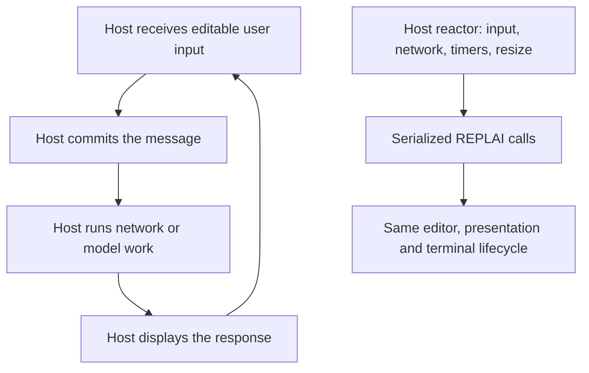

# Choose an interaction model

REPLAI is a library embedded in a host executable. These examples are complete
local hosts, not installed commands or connections to external services. Run them
from a checkout on Linux or macOS with a current stable Rust toolchain.

## Runnable map

| Need | Run from the repository | Host owns | REPLAI owns |
| --- | --- | --- | --- |
| A small deterministic command loop | `cargo run --locked --example simple` | Execute each submitted line; admit history | Blocking editable input; typed interrupt/EOF; restoration |
| Explicit console with synchronous completion | `cargo run --locked --example completion` | Catalog, prefix filtering, ordering | Revision validation, candidate menu, acceptance |
| Validated multiline statements | `cargo run --locked --example validation` | The example's brace grammar | Enter request, stale refusal, newline continuation, diagnostics |
| Results and notices during editing | `cargo run --locked --example query -- --notice` | Static result data and notice timing | Tables, prompt/draft/cursor restoration |
| Validated input in a host reactor | `cargo run --locked --example validation-driven` | Brace grammar and native waiting | Same request/result contract as session mode |
| Independent timer/socket events | `cargo run --locked --example driven` | Native wait loop, application events, resize notifications | Readiness interest, deadlines, serialized output |
| Retained host analysis | `cargo run --locked --example analysis` | Work derived from one snapshot | Immutable revision identity and stale-safe replacement |
| Plain captured report | `cargo run --locked --example report > report.txt` | Facts and semantic classification | Safe document layout without an active editor |
| Responsive structured output | `cargo run --locked --example structured -- 24` | Blocks, labels, values and ordering | Cell widths, wrapping, table fallback |
| C/C++ application | See [staged C integration](c-api.md) | Application loop and discovery | ABI 1 session, direct submission and replacement |

The examples use fixture data. `query` does not connect to a database; `driven`
does not call a model; `validation` is a deliberately small host grammar, not a
shell parser. Windows currently executes portable model tests and standalone
presentation; it has no interactive terminal backend.

## Executed recipe index

Every supported recipe below names its execution carrier. `Portable` means the
editor/model contract is exercised without claiming a terminal backend. Native
interactive recipes require Linux or macOS. The two unsupported rows are scope
statements and deliberately have no executable workaround inside REPLAI.

| Recipe | Surface | Execution carrier |
| --- | --- | --- |
| <!-- recipe:simple-loop --> Simple read/evaluate loop | Linux/macOS · Rust | `cargo run --locked --example simple` |
| <!-- recipe:history-admission --> Host-controlled history admission | Portable model + Linux/macOS | `examples/simple.rs`, `tests/core.rs` |
| <!-- recipe:history-persistence --> Persistence/reload owned by the application | Host responsibility | admission round-trip in `tests/core.rs` |
| <!-- recipe:rich-completion --> Rich completion | Linux/macOS · Rust | `cargo run --locked --example completion` |
| <!-- recipe:validated-multiline --> Validated multiline | Linux/macOS · Rust | `cargo run --locked --example validation` |
| <!-- recipe:delayed-analysis --> Delayed revision-bound analysis | Linux/macOS · Rust | `cargo run --locked --example analysis-presentation -- --delayed-analysis` |
| <!-- recipe:spans-hints --> Host spans and hints | Linux/macOS · Rust | `cargo run --locked --example analysis-presentation` |
| <!-- recipe:reactor --> Existing reactor | Linux/macOS · Rust | `cargo run --locked --example driven` |
| <!-- recipe:finite-notices --> Finite notices while editing | Linux/macOS · Rust | `cargo run --locked --example query -- --notice` |
| <!-- recipe:coalesced-output --> Host-coalesced output | Linux/macOS · Rust | `examples/driven.rs` |
| <!-- recipe:closed-chat-stream --> Turn-by-turn model/chat output after close | Host I/O + Rust input | [chat recipe](#a-chat-or-model-client) |
| <!-- recipe:structured-report --> Structured standalone report | Portable · Rust | `cargo run --locked --example report` |
| <!-- recipe:c-pkg-config --> C pkg-config installation | Linux/macOS · C ABI 1 | `python3 tools/qualify_c.py --phase all` |
| <!-- recipe:cmake-static --> CMake static consumer | Linux/macOS · C ABI 1 | `find_package(replai CONFIG REQUIRED)` + `replai::static` |
| <!-- recipe:cmake-shared --> CMake shared consumer | Linux/macOS · C ABI 1 | `find_package(replai CONFIG REQUIRED)` + `replai::shared` |
| <!-- recipe:cpp --> C++ consumer | Linux/macOS · C ABI 1 | C++17 static/shared matrix in `tools/qualify_c.py` |
| <!-- recipe:no-color --> Plain interaction | Linux/macOS · Rust/C ABI 1 | `NO_COLOR=1 cargo run --locked --example validation` |
| <!-- recipe:secret-input --> Secret input | Unsupported in v0.1 candidate | Use an independently audited secret-entry mechanism |
| <!-- recipe:concurrent-writers --> Concurrent independent writers | Unsupported in v0.1 candidate | Serialize output in the host |

## Try validated multiline input

```sh
cargo run --locked --example validation
```

Type `{`, press Enter, type `task`, press Enter, then type `}` and press Enter.
The host receives the complete eight-byte draft, including its two newlines.
For indentation, press Tab before `task`: REPLAI inserts four spaces and the host
receives twelve bytes instead. Repeated Tab advances to the next four-cell stop.
Try `}` in an empty draft to see a diagnostic; Backspace removes the character
and invalidates its diagnostic. Ctrl-C interrupts editing; Ctrl-D on an empty
draft returns EOF. REPLAI itself never terminates the application on Ctrl-C.

| Key with validated submission enabled | Behavior |
| --- | --- |
| Enter, no completion menu | Request host validation for an immutable snapshot |
| Enter, completion menu visible | Accept the candidate only; another Enter requests validation |
| Tab in leading spaces/tabs on a continuation line | Insert spaces to the next four-cell indentation stop |
| Tab elsewhere / with a completion menu | Request completion / select next candidate |
| Up / Down | Previous/next LF-delimited line at the current display column; history at first/last line |
| Left / Right | Grapheme movement, including through soft-wrapped rows |
| Ctrl-A / Ctrl-E | Beginning/end of the entire draft, preserving existing bindings |
| Escape with diagnostics visible | Dismiss diagnostic presentation; text and revision remain unchanged |
| Bracketed multiline paste | One atomic edit; validation occurs only on a later Enter |

Vertical movement clamps at short lines and uses that resulting column for the
next move. History entries are editable multiline drafts; reach the last logical
line and press Down to return to the saved unsent draft. Direct-submission hosts
retain the existing Up/Down history behavior. No force-submit shortcut bypasses
host validation. Hosts can insert explicit LF with the existing safe replacement
API; there is no new configurable keymap or newline binding.

## A deterministic command interpreter

Start with `Interaction::read_line`. Match `ReadOutcome`, evaluate submitted text
in host code, optionally admit it to history, clear the retained editor and repeat.
There is no polling loop to write. History admission and persistence are separate:
REPLAI provides in-memory navigation; the application decides which commands to
remember. Use session mode when completion or validation is needed.

Persist only values your application admits. On startup, load records under the
application's privacy and retention policy and call `admit_history` for each
accepted entry. REPLAI supplies bounded navigation; it supplies neither a history
database nor reverse/provider search.

A synchronous validated session opts into `SubmissionPolicy::Validated` while
closed. After `Event::SubmissionRequested(snapshot)`, parse that snapshot in host
code and pass `ValidationResult::new(snapshot.revision(), disposition)` to
`apply_validation`. Handle its returned `event`: a successful Complete returns
`Submitted` there exactly once. Polling does not return it again.

## A chat or model client

Choose the simplest ownership that matches the product:



For a turn-by-turn chat, blocking input is often sufficient. Once `read_line`
returns, the terminal is restored. The host owns message storage, provider calls,
response streaming, cancellation and any output written while REPLAI is closed.
Use standalone `Document` rendering for structured final results. History should
be admitted explicitly; message persistence is not supplied by the editor.

For a client that accepts input while application events arrive, use driven mode.
The host waits on `input_source()` and its own network/timer sources, honoring
`wait_interest()` and its optional deadline. It forwards resize notifications via
`Wake::Resize`. On an application event it may call `external_output` or
`output_document`, then return to its reactor. These calls are synchronous and
serialized; no independent concurrent writers, token-stream protocol, background
queue or model-cancellation semantics are supplied. The [driven example](../examples/driven.rs)
uses a local timer to demonstrate that coordination without credentials.

Slow validation or completion stays host-scheduled: retain a snapshot, continue
editing, and deliver the result later. A changed draft produces `Stale` with no
submission, newline, menu, diagnostic or terminal bytes. Host context changes
(provider, directory, schema or conversation) need the host's own job filtering.

## Terminal configurations

```sh
# Styled terminal; actual capability admission still applies.
TERM=xterm-256color cargo run --locked --example validation
# Same structure and selected-item/diagnostic cues without styling.
NO_COLOR=1 cargo run --locked --example validation
NO_COLOR=1 cargo run --locked --example completion
# Width is an argument of the standalone structured example.
for width in 20 40 80 132; do
    NO_COLOR=1 cargo run --locked --example structured -- "$width"
done
# Plain standalone output remains valid under dumb/captured output.
TERM=dumb NO_COLOR=1 cargo run --locked --example report > report.txt
# Deliberate negative cases: conservative interactive admission must refuse.
TERM=dumb cargo run --locked --example simple
cargo run --locked --example simple < /dev/null
```

Resize the real terminal window to exercise interactive geometry; passing a
width to `structured` does not resize an editor. Do not set TERM to a fabricated
value to bypass unsuitable-terminal failures. The first command above assumes a
real VT-compatible terminal. For explicit facts, no-paste configurations, styling
requirements and compatibility admission, see the [capability contract](interaction.md#terminal-capabilities).

## Developer verification

```sh
cargo test --locked --test validation
cargo test --locked --lib validation_tests
cargo test --locked --test capabilities --test capabilities_pty
python3 tools/validation_pty.py --work /tmp/replai-validation-check
python3 tools/validation_pty.py --memory --work /tmp/replai-validation-memory
python3 tools/qualify.py --work /tmp/replai-full-check
```

Use fresh evidence directories. Native memory qualification needs Valgrind on
Linux or `leaks` on macOS. The external fixture multiplexes a real terminal with
an independent socket, delays host decisions, checks stale silence, output,
resize, large paste, completion precedence and exact restoration. The [development
method](development.md) lists all tool prerequisites and full qualification.
These commands test implemented contracts; they do not claim every emulator or
application configuration is qualified.

## Host-derived editor styles and hints

```sh
cargo run --locked --example analysis-presentation
NO_COLOR=1 cargo run --locked --example analysis-presentation
```

Type `bu`: the host styles that draft and supplies an explicitly marked suffix:

```text
analyze> bu [~ild · Tab for candidates]
```

Enter submits only `bu`. Tab requests host candidates; Enter with a menu accepts
one without submitting. Braces exercise host validation and multiline continuation.
The example caches one host parse per draft revision and derives I1/I2/I3 results
from it. `[~...]` is display only, including under NO_COLOR. Use session/driven
integration to receive delayed host analysis; the simplest blocking API stays
unchanged. See the [I2 contract](interaction.md#editor-analysis-presentation).

## Installed C and C++ recipes

Build and stage the C ABI producer from the versioned source SDK, then consume
only the installed prefix. Building the SDK requires Rust; consuming an already
staged installation does not.

```sh
cargo build --locked --release -p replai-c
python3 tools/stage_c.py --prefix /tmp/replai-prefix
export PKG_CONFIG_PATH=/tmp/replai-prefix/lib/pkgconfig
cc -std=c11 consumer.c $(pkg-config --cflags --libs replai) -o consumer
```

For CMake, select the artifact explicitly:

```cmake
find_package(replai 0.1 CONFIG REQUIRED)
target_link_libraries(consumer PRIVATE replai::static) # or replai::shared
```

Configure with
`cmake -S . -B build -DCMAKE_PREFIX_PATH=/tmp/replai-prefix`. The same imported
targets accept a C++17 consumer because the ABI header has C++ guards. The full
qualification moves the prefix before building fresh C11 and C++17 consumers,
so these recipes do not depend on checkout paths or a global installation. See
the [source SDK and installed-prefix contract](c-sdk.md).

## Output boundary recipes

Finite application notices can be rendered while editing through serialized
`external_output` or `output_document` calls. Coalesce a bounded batch into one
document when several facts arrive together. The host remains the only caller
mutating `Interaction`.

For turn-by-turn model or network output, let `read_line` return and restore the
terminal, stream through the host's own I/O while the editor is closed, then open
the next interaction. The v0.1 candidate does not promise sustained token output
through an active editor, independent concurrent writers, or fairness/latency
for such writers.

Sensitive input is outside the selected contract: REPLAI does not suppress echo
as a password-entry API or guarantee secret erasure. Use a separate mechanism
whose memory and terminal policy matches the application. Do not emulate this by
changing REPLAI themes.
