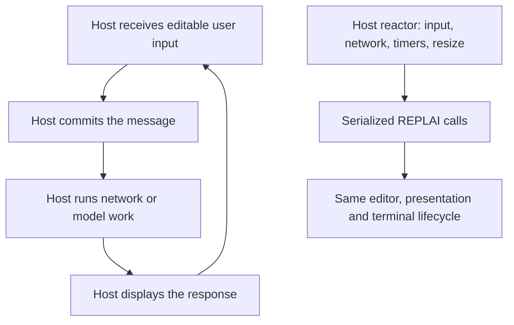

# Choose an interaction model

REPLAI is a library embedded in a host executable. These examples are complete
local hosts, not installed commands or connections to external services. Run them
from a checkout on Linux or macOS with a current stable Rust toolchain.

## Runnable map

| Need | Run from the repository | Host owns | REPLAI owns |
| --- | --- | --- | --- |
| A small deterministic command loop | `cargo run --locked --example simple` | Execute each submitted line; admit history | Blocking editable input; typed interrupt/EOF; restoration |
| Explicit console with synchronous completion | `cargo run --locked --example completion` | Catalog, prefix filtering, ordering | Revision validation, candidate menu, acceptance |
| Validated multiline statements | `cargo run --locked --example validation` | The example's brace grammar | Enter request, stale refusal, newline continuation, diagnostics |
| Results and notices during editing | `cargo run --locked --example query -- --notice` | Static result data and notice timing | Tables, prompt/draft/cursor restoration |
| Validated input in a host reactor | `cargo run --locked --example validation-driven` | Brace grammar and native waiting | Same request/result contract as session mode |
| Independent timer/socket events | `cargo run --locked --example driven` | Native wait loop, application events, resize notifications | Readiness interest, deadlines, serialized output |
| Retained host analysis | `cargo run --locked --example analysis` | Work derived from one snapshot | Immutable revision identity and stale-safe replacement |
| Plain captured report | `cargo run --locked --example report > report.txt` | Facts and semantic classification | Safe document layout without an active editor |
| Responsive structured output | `cargo run --locked --example structured -- 24` | Blocks, labels, values and ordering | Cell widths, wrapping, table fallback |
| C/C++ application | See [staged C integration](c-api.md) | Application loop and discovery | ABI 1 session, direct submission and replacement |

The examples use fixture data. `query` does not connect to a database; `driven`
does not call a model; `validation` is a deliberately small host grammar, not a
shell parser. Windows currently executes portable model tests and standalone
presentation; it has no interactive terminal backend.

## Try validated multiline input

```sh
cargo run --locked --example validation
```

Type `{`, press Enter, type `task`, press Enter, then type `}` and press Enter.
The host receives the complete eight-byte draft, including its two newlines.
Try `}` in an empty draft to see a diagnostic; Backspace removes the character
and invalidates its diagnostic. Ctrl-C interrupts editing; Ctrl-D on an empty
draft returns EOF. REPLAI itself never terminates the application on Ctrl-C.

| Key with validated submission enabled | Behavior |
| --- | --- |
| Enter, no completion menu | Request host validation for an immutable snapshot |
| Enter, completion menu visible | Accept the candidate only; another Enter requests validation |
| Up / Down | Previous/next LF-delimited line at the current display column; history at first/last line |
| Left / Right | Grapheme movement, including through soft-wrapped rows |
| Ctrl-A / Ctrl-E | Beginning/end of the entire draft, preserving existing bindings |
| Escape with diagnostics visible | Dismiss diagnostic presentation; text and revision remain unchanged |
| Bracketed multiline paste | One atomic edit; validation occurs only on a later Enter |

Vertical movement clamps at short lines and uses that resulting column for the
next move. History entries are editable multiline drafts; reach the last logical
line and press Down to return to the saved unsent draft. Direct-submission hosts
retain the existing Up/Down history behavior. No force-submit shortcut bypasses
host validation. Hosts can insert explicit LF with the existing safe replacement
API; there is no new configurable keymap or newline binding.

## A deterministic command interpreter

Start with `Interaction::read_line`. Match `ReadOutcome`, evaluate submitted text
in host code, optionally admit it to history, clear the retained editor and repeat.
There is no polling loop to write. History admission and persistence are separate:
REPLAI provides in-memory navigation; the application decides which commands to
remember. Use session mode when completion or validation is needed.

A synchronous validated session opts into `SubmissionPolicy::Validated` while
closed. After `Event::SubmissionRequested(snapshot)`, parse that snapshot in host
code and pass `ValidationResult::new(snapshot.revision(), disposition)` to
`apply_validation`. Handle its returned `event`: a successful Complete returns
`Submitted` there exactly once. Polling does not return it again.

## A chat or model client

Choose the simplest ownership that matches the product:



For a turn-by-turn chat, blocking input is often sufficient. Once `read_line`
returns, the terminal is restored. The host owns message storage, provider calls,
response streaming, cancellation and any output written while REPLAI is closed.
Use standalone `Document` rendering for structured final results. History should
be admitted explicitly; message persistence is not supplied by the editor.

For a client that accepts input while application events arrive, use driven mode.
The host waits on `input_source()` and its own network/timer sources, honoring
`wait_interest()` and its optional deadline. It forwards resize notifications via
`Wake::Resize`. On an application event it may call `external_output` or
`output_document`, then return to its reactor. These calls are synchronous and
serialized; no independent concurrent writers, token-stream protocol, background
queue or model-cancellation semantics are supplied. The [driven example](../examples/driven.rs)
uses a local timer to demonstrate that coordination without credentials.

Slow validation or completion stays host-scheduled: retain a snapshot, continue
editing, and deliver the result later. A changed draft produces `Stale` with no
submission, newline, menu, diagnostic or terminal bytes. Host context changes
(provider, directory, schema or conversation) need the host's own job filtering.

## Terminal configurations

```sh
# Styled terminal; actual capability admission still applies.
TERM=xterm-256color cargo run --locked --example validation
# Same structure and selected-item/diagnostic cues without styling.
NO_COLOR=1 cargo run --locked --example validation
NO_COLOR=1 cargo run --locked --example completion
# Width is an argument of the standalone structured example.
for width in 20 40 80 132; do
    NO_COLOR=1 cargo run --locked --example structured -- "$width"
done
# Plain standalone output remains valid under dumb/captured output.
TERM=dumb NO_COLOR=1 cargo run --locked --example report > report.txt
# Deliberate negative cases: conservative interactive admission must refuse.
TERM=dumb cargo run --locked --example simple
cargo run --locked --example simple < /dev/null
```

Resize the real terminal window to exercise interactive geometry; passing a
width to `structured` does not resize an editor. Do not set TERM to a fabricated
value to bypass unsuitable-terminal failures. The first command above assumes a
real VT-compatible terminal. For explicit facts, no-paste configurations, styling
requirements and compatibility admission, see the [capability contract](interaction.md#terminal-capabilities).

## Developer verification

```sh
cargo test --locked --test validation
cargo test --locked --lib validation_tests
cargo test --locked --test capabilities --test capabilities_pty
python3 tools/validation_pty.py --work /tmp/replai-validation-check
python3 tools/validation_pty.py --memory --work /tmp/replai-validation-memory
python3 tools/qualify.py --work /tmp/replai-full-check
```

Use fresh evidence directories. Native memory qualification needs Valgrind on
Linux or `leaks` on macOS. The external fixture multiplexes a real terminal with
an independent socket, delays host decisions, checks stale silence, output,
resize, large paste, completion precedence and exact restoration. The [development
method](development.md) lists all tool prerequisites and full qualification.
These commands test implemented contracts; they do not claim every emulator or
application configuration is qualified.

## Host-derived editor styles and hints

```sh
cargo run --locked --example analysis-presentation
NO_COLOR=1 cargo run --locked --example analysis-presentation
```

Type `bu`: the host styles that draft and supplies an explicitly marked suffix:

```text
analyze> bu [~ild · Tab for candidates]
```

Enter submits only `bu`. Tab requests host candidates; Enter with a menu accepts
one without submitting. Braces exercise host validation and multiline continuation.
The example caches one host parse per draft revision and derives I1/I2/I3 results
from it. `[~...]` is display only, including under NO_COLOR. Use session/driven
integration to receive delayed host analysis; the simplest blocking API stays
unchanged. See the [I2 contract](interaction.md#editor-analysis-presentation).
